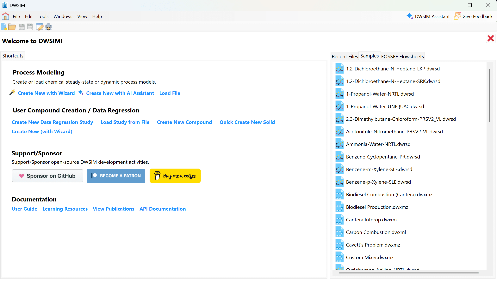

# Welcome Screen

When DWSIM is opened, the welcome screen is shown (Figure [1](#fig:figura-boasvindas)):

*DWSIM welcome screen.*

The welcome screen provides the user with shortcuts to open existing simulations, create new ones, create new compound creator and data regression cases and open the samples folder.

The following items are displayed on DWSIM’s main window:

- ***Menu bar***, with buttons to open/save/create simulations, component creator and data regression cases, configure the active simulation, general preferences, launch tools, configure the child windows view mode, etc.;

- ***Button strip,*** to open, save and create new steady-state simulations, component creator and data regression cases.

There are various ways to access the most commonly operations with simulation files and component creator/data regression cases - open, save and create. In the next sections you will be guided through some necessary steps to create and configure a steady-state simulation, a compound creator and/or a data regression case.

