# Simulation

#### User Interface

The "Create a new steady-state simulation" button in the welcome window can be used to create a new simulation. After the simulation is created, the **configuration window** (Figure [3](#fig:figura-config)) is shown. The simulation configuration interface consists in a tabbed window:

- ***Compounds* -** Add or remove compounds to/from the simulation and petroleum fractions (pseudocompounents) utilities.

- ***Basis* -** Property Package configuration, phase equilibrium flash algorithm selection and other advanced thermodynamic model settings.

- ***System* **of Units** -** Management of Systems of Units.

- ***Behavior*** - Options to control certain behaviors of the flowsheeting environment.

- ***Object Properties*** - Definition of objects properties to be shown on flowsheet floating tables.

- ***Information* -** Simulation info (title, author and description), number formatting and password settings.

#### Configuration

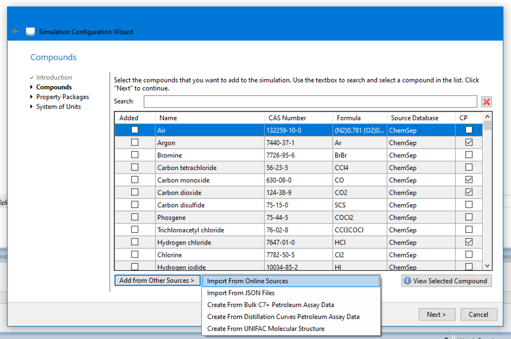

*Simulation Configuration Wizard.*

Since DWSIM 3.3, a new Simulation Configuration Wizard (Figure [2](#fig:figura-config-1)) is opened as soon as a new simulation is created, and will display the interfaces described in the following sections in a more streamlined way. The older simulation configuration window can be accessed anytime during the simulation or through a button located in the first page of the config wizard.

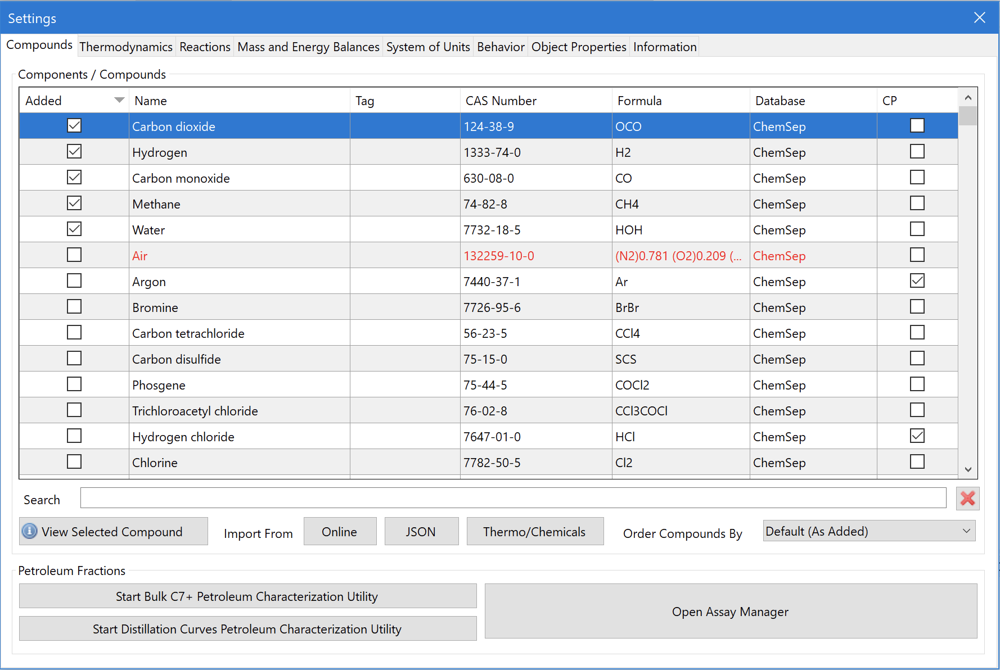

*Simulation Configuration window.*

The simulation configuration window (Figure [3](#fig:figura-config)) is the interface where all the functions for configuration and personalization of a simulation in DWSIM can be found. In this window, the user can manage the simulation components, the property package (thermodynamic model), configure the reactions environment, units system and number format, among other options.

> 
>
> | *image* | The simulation configuration window can be accessed anytime when a simulation is opened in DWSIM. The changes made through it have immediate effect on the simulation. |
> |:---|:--:|

##### Components/Compounds

There are two essential information required by DWSIM in order to correctly start a simulation. The first refers to the available ***components*** (or ***compounds***). DWSIM comes with six default compound databases (DWSIM, ChemSep, Biodiesel, CoolProp, ChEDL and Electrolytes), with a total of more than 1500 compounds available for your simulation.

To add a compound to the simulation, select it from the list on the left and click on **Add \>**. To remove an added compound, select it on the right-hand list and click **\< Remove**. To view the data from a compound from on a list, click on the appropriate **View Data** button.

DWSIM also features full compound data importing from **Online Sources** or from **JSON files**, using the appropriate buttons on the Simulation Configuration Wizard or on the Simulation Settings panel. If you manage to find a compound from these sources with a minimum set of data, they can be added directly to the simulation without further action.

**JSON** **files** are exported from the Compound Creator utility or from the Pure Compound Property Viewer tool.

##### Basis

###### Property Packages

The Property Package consists in a set of methods and models for the calculation of physical and chemical properties of material streams in the simulation. It is composed of a thermodynamic model - an equation of state or a hybrid model - and methods for property calculation, like the surface tension of the liquid phase. The figure [4](#fig:figura-PP) shows the interface for configuration of the property package.

DWSIM allows multiple Property Packages to be added to a single simulation. The Property Packages can be associated to any unit operation and material stream on a individual basis. Each property package has its own settings, even if two or more packages are of the same type.

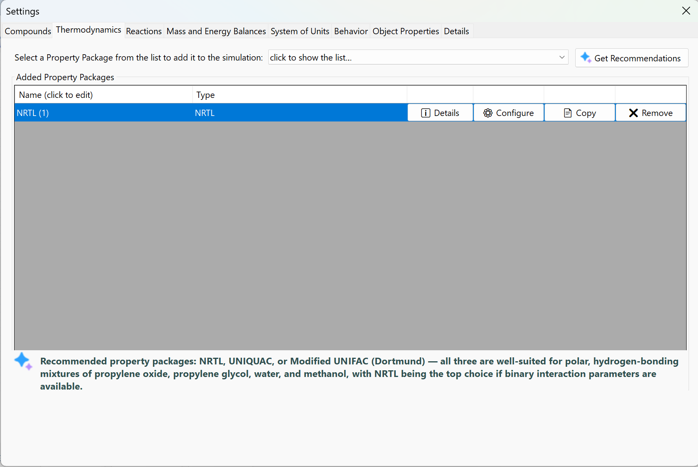

*Property Package configuration interface.*

If the selected property package has any editable property, the "Configure" button becomes clickable and the user can click on it to show the property package configuration window.

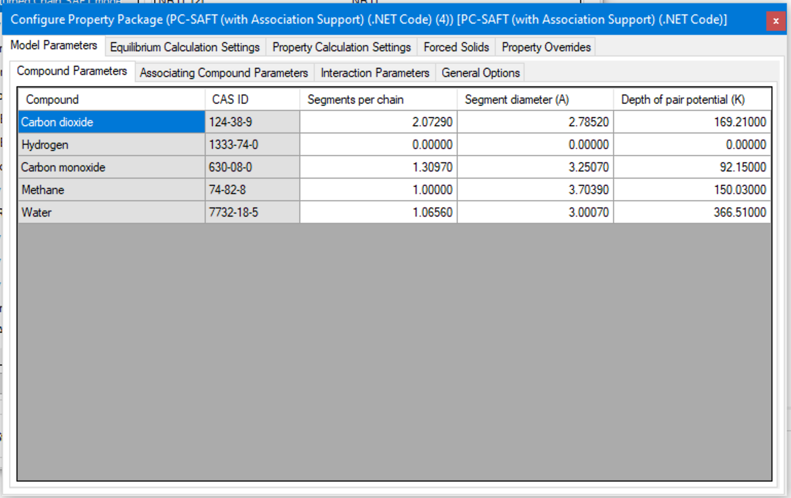

*Property package configuration window (1).*

####### Property Package configuration options

Some Property Packages have extra configuration options in order to allow a deeper control of the thermodynamic calculations for the user. They are:

- *Use Peneloux Volume Translation correction (PR/SRK EOS only)*

This option is available for PR and SRK Property Packages. It enables correction of EOS-calculated densities by the inclusion of a correction factor named *volume translation coefficient*. This option will be effective only if the EOS is selected as the calculation method for Liquid Density.

- *Ignore maximum salinity limit (IAPWS-08 Seawater Property Package only)*

Ignores the maximum supported salinity value (0.12 kg/kg) for calculations and doesn’t display any warnings. Use 0 to disable, 1 to enable this option. If enabled, the calculated salinity will be send directly to the property calculation routines without further check. If disabled, the maximum value of 0.12 will be used if the calculated salinity is higher, and a warning message will be displayed in the flowsheet log window.

- *Calculate Bubble and Dew points at stream conditions*

Check this box if you want the DWSIM to calculate bubble and dew points at conditions specified on each material stream. The calculated values will be shown only if the stream is at VLE equilibrium. The calculations are not exactly fast, so use this option with caution and only if needed.

####### Property Package Flash (Equilibrium) Calculation Settings

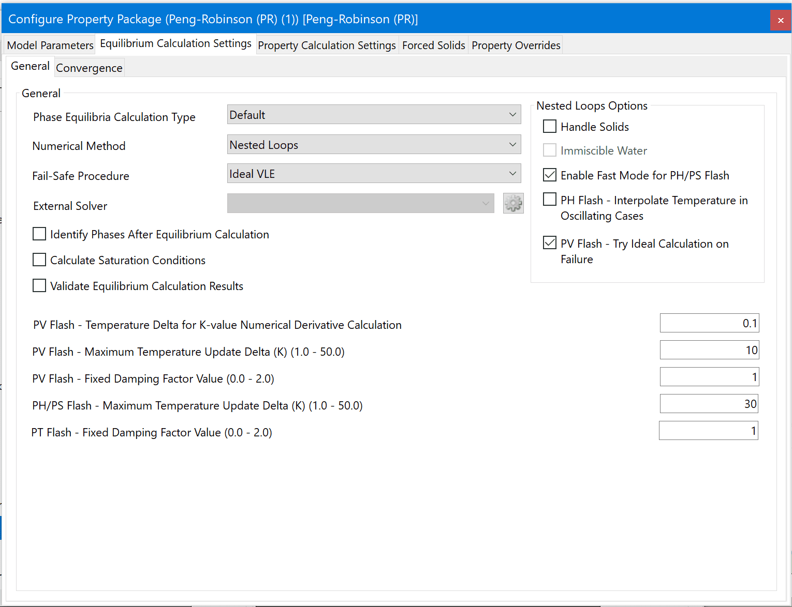

*Property Package Equilibrium Calculation Settings.*

- ***Phase Equilibria Calculation Type***

The default calculation type considers one vapor and two liquid phases. Check the "Handle Solids" box to include the solid phase in the Default equilibrium calculation mode.

Change this setting to a different value if the default setting gives you convergence errors in the simulation.

- ***Numerical Method***

You can choose from three different approaches to calculate phase equilibria: Nested Loops (default), Inside-Out and Gibbs Minimization. If an external optimizer is available, you can select one from the External Solver drop down list to use when in Gibbs Minimization mode.

- ***Fail-Safe Procedure***

Select a fail-safe calculation mode if the main phase equilibria calculation fails. You can select one of the following options:

1.  Rigorous VLE: does a VLE calculation using the currently selected Property Package.

2.  Ideal VLE: does a VLE calculation using the Raoult’s Law Property Package.

3.  Do Not Calculate Equilibrium: doesn’t perform any equilibrium calculation.

4.  Throw error/exception: this was the default behavior on older DWSIM versions.

- ***Force Pressure-Enthalpy (PH) Flash calculations***

If enabled, all requests by unit operations for Pressure-Temperature Flashes will be replaced by Pressure-Enthalpy ones.

- ***Validate Equilibrium Flash Calculation Results***

If enabled, DWSIM will check the mixture Gibbs energy before and after the equilibrium flash calculation. If the gibbs energy *increases* after the calculation (it should always *decrease* when there is a phase split), an error message will be shown and the flowsheet calculation will be aborted.

- ***Apply a Phase Identification Algorithm after Equilibrium Calculations***

Check this to apply an identification algorithm to each phase after the equilibrium calculation is finished. This can be useful for supercritical compounds which behave as liquid at high pressures and temperatures, or special mixtures which exhibit LLE behavior at low temperatures, incorrectly identified as VLE by the flash algorithms.

Visit DWSIM’s wiki for more information about the phase identification algorithm.

####### Forced Solids

Use the Forced Solids option to define the compounds which will always be in the Solid Phase.

####### Property Overrides

Since DWSIM Version 5.1, you can override the calculated phase properties through Python scripts. This can be useful if the calculated property is far from the expected value, or if you need to include advanced mixing rules when calculating mixed phase properties.

For more information, go to the [Overriding Calculated Properties](https://dwsim.inforside.com.br/wiki/index.php?title=Overriding_Calculated_Properties) page on the Wiki.

###### Property Package Selection Guide

Most thermodynamic models have binary interaction parameters which are fitted to match experimental data. Always check if the selected thermodynamic model has interaction parameters for the compounds in the simulation, if required. To view the list of IPs, open the Property Package Configuration Window and go to the Interaction Parameters tab.

Whenever possible, one should either use experimental data to check the predicted properties, or to use these data to fit suitable thermodynamic models. DWSIM has a tool to regress experimental data and calculate binary interaction parameters for various thermodynamic models.

####### Non-polar gases at low pressures (\< 10 atm) {#non-polar-gases-at-low-pressures-10-atm}

Use the Raoult’s Law Property Package. It assumes that both phases (gas and liquid) are ideal.

####### Non-polar gases at high pressures (\> 10 atm) {#non-polar-gases-at-high-pressures-10-atm}

Use one of the Equation of State models like Peng-Robinson, Soave-Redlich-Kwong and PRSV2.

####### Polar gases at high pressures (\> 10 atm) {#polar-gases-at-high-pressures-10-atm}

Use the PRSV2 Property Package. Check if it has the required parameters for your system as DWSIM lacks many parameters for this model. If it doesn’t, fallback to an EOS model like PR or SRK.

####### Systems with high Hydrogen content

You can use the Chao-Seader, Grayson-Streed or Lee-Kesler-Plöcker model. The LKP model is very slow but can be more reliable depending on the system. The LKP model is very sensitive to the interaction parameter values being used.

####### Air Separation / Refrigeration systems {#air-separation-refrigeration-systems}

Use the CoolProp Property Package.

####### Steam/Water simulations

Use the Steam Tables Property Package.

####### Polar chemicals

Use one of the activity coefficient models like NRTL or UNIQUAC. If no interaction parameters are available for your system, you can fallback to one of the UNIFAC-type models. Modified UNIFAC (NIST) is recommended.

####### Salt/Water systems

Use the Seawater Property Package.

##### Systems of Units

Three basic units systems are present in DWSIM: ***SI System*** (selected by default), ***CGS System*** and ***English (Imperial) System***. The simulation’s units system can be viewed/modified in the "Units System" section of the "Options" tab in the simulation configuration window (Figure [7](#fig:figura-SU)).

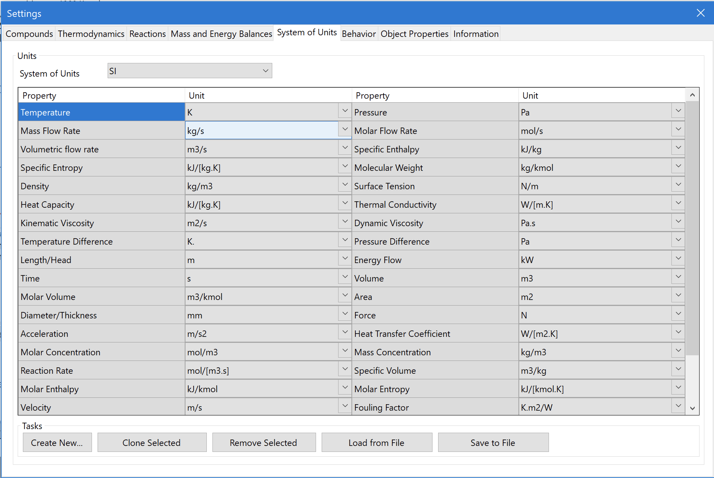

*System of Units configuration interface.*

There are buttons available on this interface to create custom units systems and save/load them. It is worth remembering that the units systems can also be modified at any time during the simulation - the changes are applied immediately.

##### Behavior

###### Behavior options for Flowsheet Objects

- ***Skip Equilibrium Calculation in Well-Defined Streams***

Tells the Flowsheet Solver to avoid doing unnecessary work and skip equilibrium calculations in Material Streams connected to specific ports like Separator Vessel and Distillation Column outlets.

- ***Force Material Stream Phase***

You can override the equilibrium phase for **all** Material Streams in the flowsheet by setting this property property to the desired value (*Vapor*, *Liquid* or *Solid*. The default value is *Do Not Force*.

When this property is set to one of the phase names (*Vapor*, *Liquid* or *Solid*), the equilibrium calculation for all Material Streams is bypassed and all compounds are put into the selected phase with the same composition as the mixture.

- ***Force object calculation even when input parameters don’t change***

This is the main feature of the Smart Object Solver added in v8.4. You can turn it off by unchecking the corresponding box.

- ***Specification Blocks calculation mode***

You can define how and when the specification blocks are calculated in the flowsheet.

###### Number Formatting

- ***Numerical Values Formatting Scheme:*** select the formatting for general numbers.

- ***Stream Composition Formatting Scheme:*** select the formatting for stream compositions.

###### General

- ***Enable Undo/Redo:*** allows the flowsheet to quickly return to a previous state.

- ***Include flowsheet messages when saving file:*** for debugging purposes, the log messages are added to the flowsheet file by default.

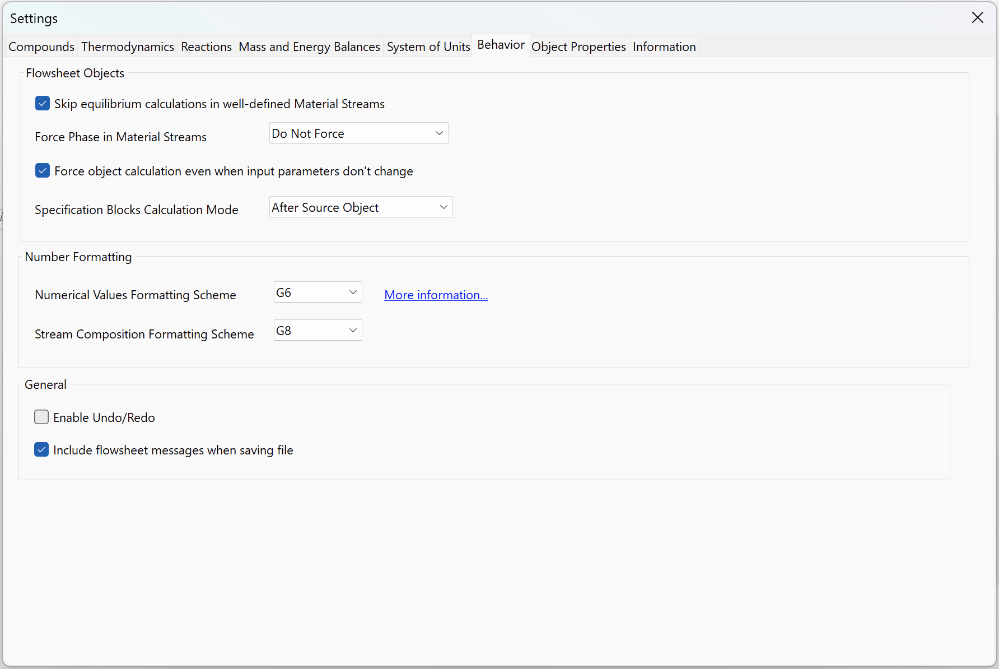

*Behavior settings interface.*

##### Information

In the "Description" group box it is possible to edit some information about the active simulation (title, author and description). You can also define a password to prevent the simulation of being opened by anyone, but this feature only works with the Compressed XML simulation file format (\*.dwxmz).

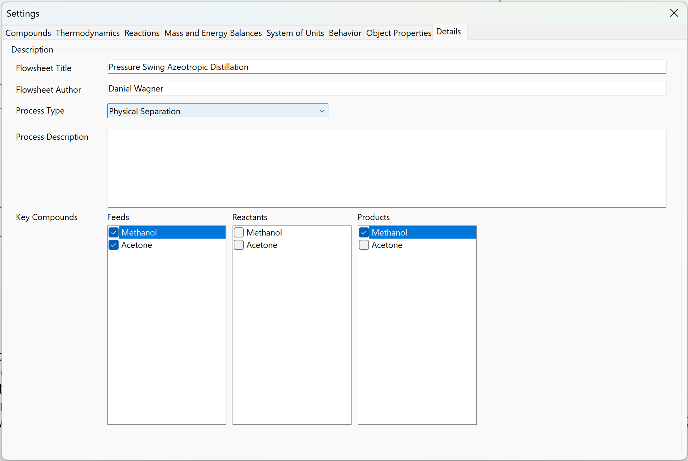

*Information settings interface.*

##### Property Tables

In the "Property Tables" section you can define which properties are going to be shown for each object type when you hover the mouse over the objects on the flowsheet. The property list is saved in a per-simulation basis.

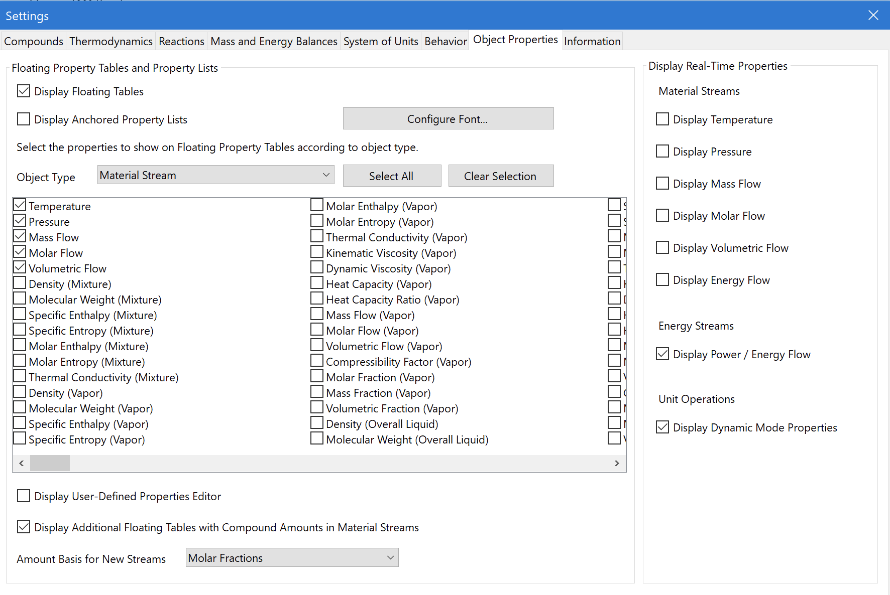

*Property Tables settings interface.*

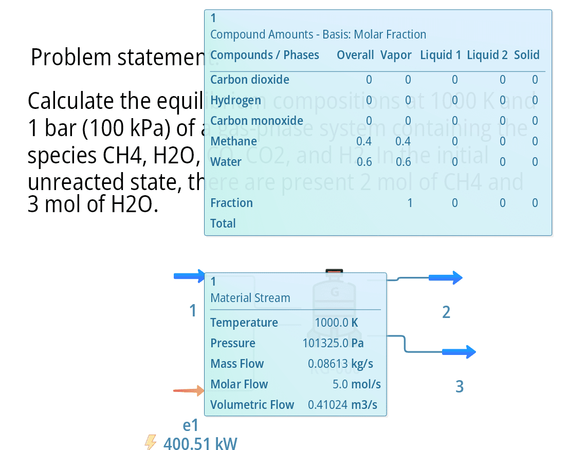

*Selected properties on the previous image are shown on the flowsheet for the Material Streams.*

#### Process Modeling (Flowsheeting)

After configuring the simulation, the user is taken to the main simulation window (Figure [12](#fig:figura-JanelaSImulacao)). In this window we can highlight the following areas:

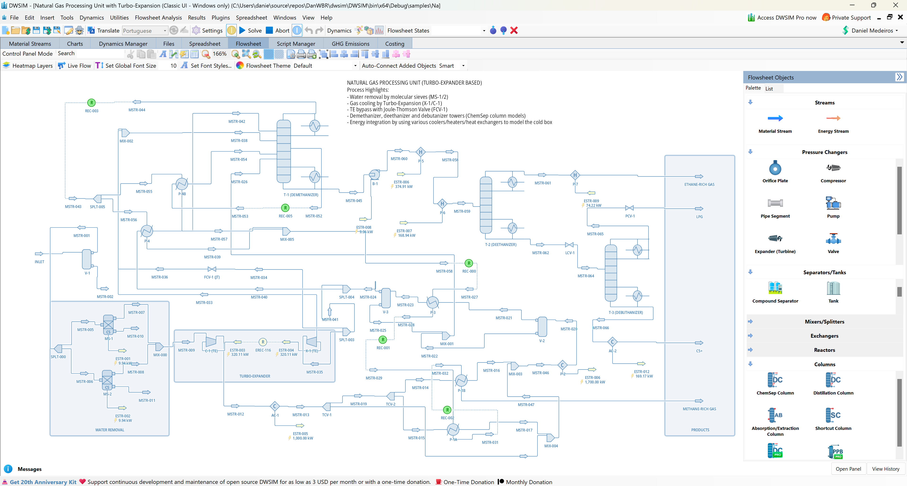

*DWSIM simulation window.*

- ***Menu Bar***: file handling, window arrangement, help, simulation settings, solver controls, undo/redo buttons.

- ***Flowsheet Objects Palette*** window: shows objects which can be added by dragging them into the PFD;

- ***Flowsheet Objects List*** window: contains a searchable list of the flowsheet objects, including shortcuts to edit, rename and delete items;

- ***Material Streams*** window: lists the material streams in the flowsheet and their calculated properties;

- ***Flowsheet*** window: process flowsheet building and editing area;

- ***Information*** window: general information about the active simulation;

- ***Spreadsheet*** window: shows the spreadsheet, a utility to do math operations with data provided by the objects in the current simulation;

- ***Charts*** window: used to create and view charts from flowsheet objects or from spreadsheet data;

- ***Script Manager*** window: displays the script manager, which can be used to write Python scripts to automate certain simulation tasks.

When running DWSIM on a Windows platform, the simulation windows can be freely repositioned, with the arrangement information being saved together with the rest of simulation data. To reposition a window, the user should click with the left mouse button in the window’s top bar and drag it to the desired place. A preview of how the window will be is shown in blue (Figure [13](#fig:figura-posicaojanelas)).

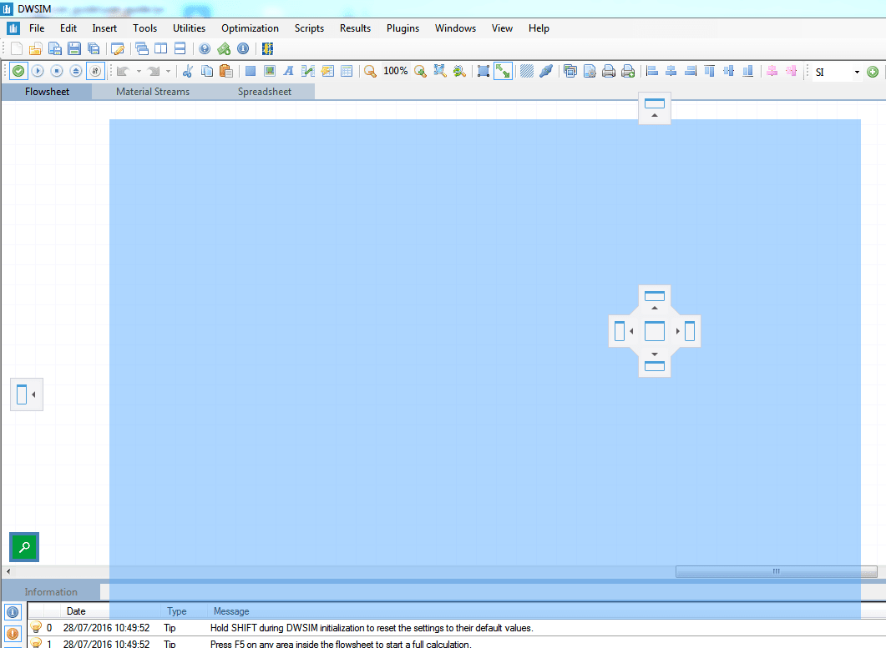

*Window repositioning.*

##### Inserting Flowsheet Objects

To add an object to the flowsheet, you can:

- Use the **Insert \> Flowsheet Object** menu item (keyboard shortcut: Ctrl+A):

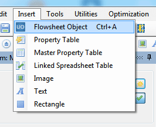

*Inserting an object to the flowsheet.*

- Drag an item from the **Object Pallette** window located on the bottom of the flowsheet panel:

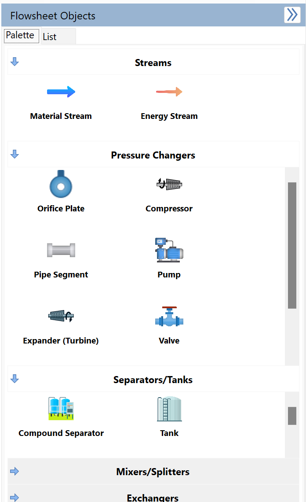

*Inserting an object to the flowsheet by dragging from the Object Pallette window.*

The elements of a simulation (objects) which can be added to the flowsheet are:

- ***Material Stream***: used to represent matter which enters and leaves the limits of the simulation and passes through the unit operations. The user should define their conditions and composition in order for DWSIM to calculate their properties accordingly;

- ***Energy Stream***: used to represent energy which enters and leaves the limits of the simulation and passes through the unit operations;

- ***Mixer***: used to mix up to three material streams into one, while executing all the mass and energy balances;

- ***Energy Mixer:*** mix up to three energy streams into one;

- ***Splitter***: mass balance unit operation - divides a material stream into two or three other streams;

- ***Valve***: works like a fixed pressure drop for the process, where the outlet material stream properties are calculated beginning from the principle that the expansion is an isenthalpic process;

- ***Pipe***: simulates a fluid flow process (mono or two-phase). The pipe implementation in DWSIM provides the user with various configuration options, including heat transfer to environment or even to the soil in buried pipes. Two correlations for pressure drop calculations are available: Beggs & Brill and Lockhart & martinelli. Both reduces to Darcy equation in the case of single-phase flow;

- ***Pump***: used to provide energy to a liquid stream in the form of pressure. The process is isenthalpic, and the non-idealities are considered according to the pump efficiency, which is defined by the user;

- ***Tank***: in the current version of DWSIM, the tank works like a fixed pressure drop for the process;

- ***Separator Vessel***: used to separate the vapor and liquid phases of a stream into two other distinct streams;

- ***Compressor***: used to provide energy to a vapor stream in the form of pressure. The ideal process is isentropic (constant entropy) and the non-idealities are considered according to the compressor efficiency, which is defined by the user;

- ***Expander***: the expander is used to extract energy from a high-pressure vapor stream. The ideal process is isentropic (constant entropy) and the non-idealities are considered according to the expander efficiency, which is defined by the user;

- ***Heater***: simulates a stream heating process;

- ***Cooler***: simulates a stream cooling process;

- ***Conversion Reactor***: simulates a reactor where conversion reactions occur;

- ***Equilibrium Reactor***: simulates a reactor where equilibrium reactions occur;

- ***PFR***: simulates a Plug Flow Reactor (PFR);

- ***CSTR***: simulates a Continuous-Stirred Tank Reactor (CSTR);

- ***Shortcut Column***: simulates a simple distillation column with approximate results using shorcut calculations;

- ***Distillation Column***: simulates a distillation column using rigorous thermodynamic models;

- ***Absorption Column***: simulates an absorption column using rigorous thermodynamic models;

- ***Refluxed Absorber***: simulates a refluxed absorber column using rigorous thermodynamic models;

- ***Orifice Plate:*** model to simulate an orifice plate, used for flow metering;

- ***Component Separator:*** model to simulate a generic process for component separation;

- ***Custom Unit Operation:*** an user-defined model based on Python scripts;

- ***CAPE-OPEN Unit Operation:*** External CAPE-OPEN Unit Operation socket for adding CO Unit Operations in DWSIM;

- ***Spreadsheet Unit Operation:*** Unit Operation where the model is defined and calculated in Spreadsheet (XLS/XLSX/ODS) files;

- ***Solids Separator:*** model to simulate a generic process for solid compound separation;

- ***Continuous Cake Filter:*** continuous cake filter model for solids separation;

- ***Air Cooler 2:*** unit operation that is used to cool a material stream using air;

- ***Water Electrolyzer:*** electrolysis model for H2 generation from water;

- ***PEM Fuel Cell:*** Proton-exchange Membrane Fuel Cell model for energy generation from H2 and O2;

- ***Hydroelectric Turbine:*** generates energy from a water stream;

- ***Wind Turbine:*** generates energy from wind;

- ***Solar Panel:*** generates energy from solar energy;

- ***Gibbs Reactor (Reaktoro):*** general-purpose chemical reactor based on Reaktoro.

Additionally, the following logical operations are available in DWSIM:

- ***Controller:*** used to make a variable to be equal to a user-defined value by changing the value of other (independent) variable;

- ***Specification***: used to make a variable to be equal to a value that is a function of other variable, from other stream;

- ***Recycle***: used to mix downstream material with upstream material in a flowsheet,

- ***Energy Recycle***: used to mix downstream energy with upstream energy in a flowsheet.

- ***Input Box:*** use to quickly change a property of an object;

- ***Switch:*** used to switch the value of a property of an object between two values;

Figure [14](#fig:figura-matno fluxog) shows a material stream added to the flowsheet by one of the method described above. It can be observed that the stream is selected and that its property editor is shown as a panel on the left part of the main window.

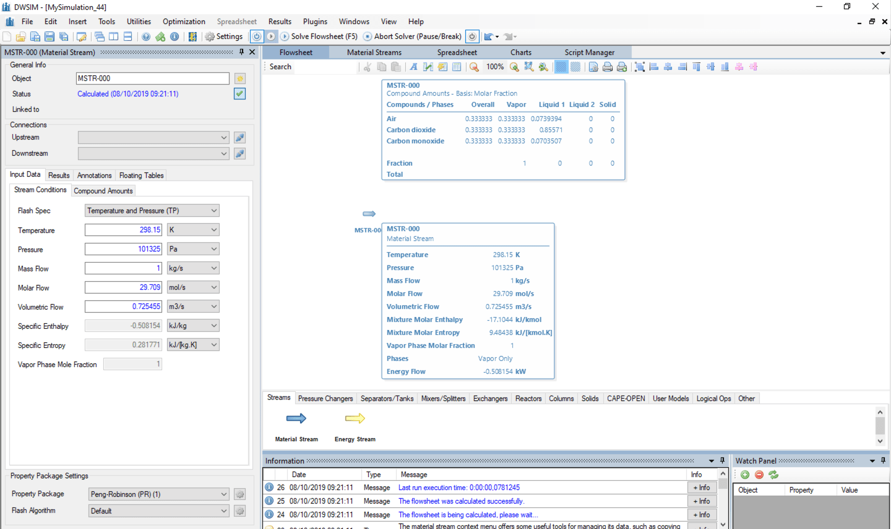

*A material stream in the flowsheet.*

###### *Connecting objects* {#connecting-objects .unnumbered}

The material streams represent mass flowing between unit operations. There are two different ways in which a material stream can be connected to a unit operation (or *vice-versa*):

- Through the context menu activated with a right mouse button click over the object (Figure [15](#fig:figura-contextmenu));

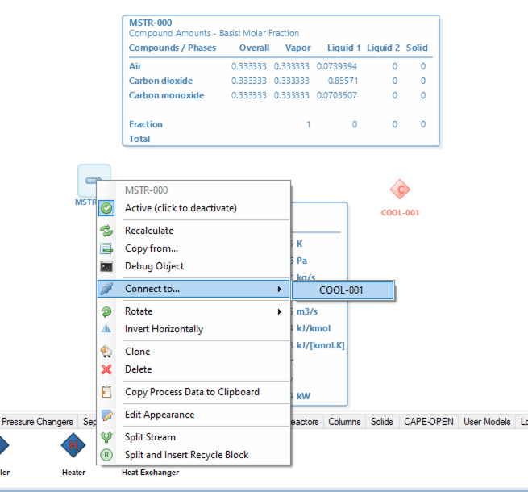

*Selected object context menu.*

- Through the property editor window - Connections section.

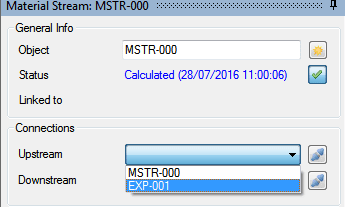

*Connection selection menu.*

- Through the "Create and Connect" buttons on the object editors. When you click on these buttons, DWSIM will automatically create and connect streams to the associated ports on the selected object.

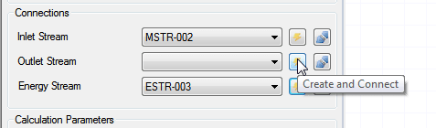

*Create and Connect tool.*

An expander system with its connections is shown on Figure [18](#fig:figura-conexaorapida3).

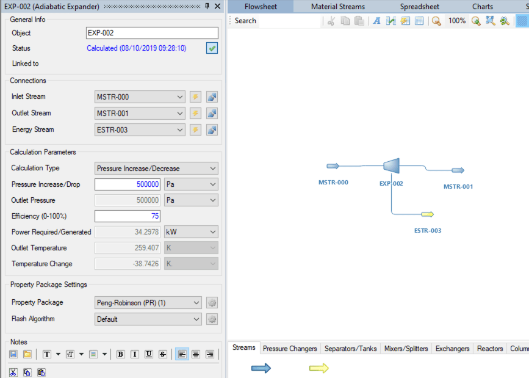

*Expander with all connections correctly configured.*

###### *Disconnecting objects* {#disconnecting-objects .unnumbered}

Tools to disconnect objects from each other can be found on the same locations as the connecting ones.

###### *Removing objects from the flowsheet* {#removing-objects-from-the-flowsheet .unnumbered}

The selected object can be removed from the flowsheet by pressing the DEL keyboard button or by using the context menu - "Delete" item (Figure [15](#fig:figura-contextmenu)).

###### Auto-Connect Added Objects

This is a new feature in DWSIM v7.4.0. It enables automatic connections between added objects and nearby ones.

There are three different options for this setting:

- **No**: No automatic connections are made when you add an object to the flowsheet.

- **Yes**: When you add a new unit operation, streams are automatically added to the flowsheet and connected to its ports.

- **Smart**: When you add a new unit operation, nearby streams are connected to it, and new streams are created to connect to the remaining ports.

##### Process data management

###### Entering process data {#entering-process-data .unnumbered}

The objects’ process data (temperature, pressure, flow, composition and/or other parameters) can be entered in the property editor window (Figure [19](#fig:figura-visual1)). Properties that cannot be edited (read-only) are grayed-out.

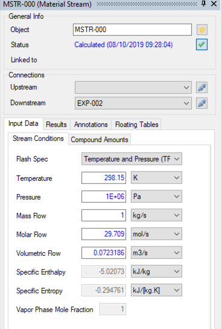

*Viewing object properties in the editor window.*

Most properties can be edited directly by typing a value in the textbox and pressing ENTER. DWSIM will then commit the new property value and trigger the flowsheet solver.

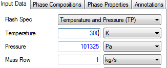

*Direct editing of a property.*

You can also use the inline units converter to convert the value of a property from the desired units to the current selected units. Type the value of the property on the textbox and select the unit to convert from at the combobox on the right. DWSIM will then convert the value from the selected units on the combobox to the actual units of the simulation system of units.

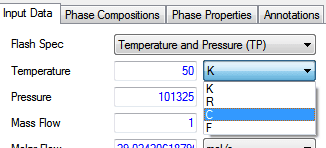

*Converting 50 C to the current temperature units (K).*

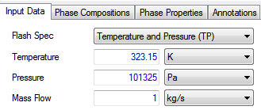

*Converted temperature value (323.15 K).*

If all object properties were correctly defined, it will be calculated by DWSIM and its flowsheet representation will have a blue border instead of a red one, indicating that the object was calculated successfully (Figure [23](#fig:figura-objcalc)).

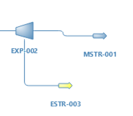

*Calculated objects.*

##### Cut/Copy/Paste objects

DWSIM also supports cutting, copying and pasting flowsheet objects inside a flowsheet or between different flowsheets. When copying objects between flowsheets, DWSIM may also copy compounds and property packages from one flowsheet to another. Cut/Copy/Paste behavior is an application setting and can be set in the General Settings menu (Section ).

##### Simulation

DWSIM is a sequential modular process simulator, that is, all calculations are made in a per-module basis, according to the connections between the objects. The calculator checks if an object has all of its properties defined and, if yes, passes the data for the downstream object and calculates it, repeating the process in a loop until it reaches an object that doesn’t have any of its dowstream connections attached to any object. This way, the entire flowsheet can be calculated as many times as necessary without having to "tell" DWSIM which object must be calculated. In fact, this is done indirectly if the user define all the properties and make all connections between objects correctly.

**DWSIM’s calculation starts when the user edits a property which defines an object.** For example, editing a stream mass flow when its temperature, pressure and composition are already well-defined activates DWSIM‘s calculator.

It is possible to control DWSIM’s calculator by using its button bar (Figure [24](#fig:figura-calculador)). Clicking on the image button activates or deactivates the calculator. The image button performs a full flowsheet recalculation. DWSIM’s calculator is enabled by default - if it is disabled, modifying of a property is accepted, but **does not** recalculate the object nor the ones that are downstream in the flowsheet. The image button stops the any ongoing calculation.

*DWSIM’s calculator control bar.*

As DWSIM’s calculator does its job, messages are added to the "Information" window. These messages tell the user if the object was calculated successfully or if there was an error while calculating it, among others (Figure [25](#fig:figura-mensagem)).

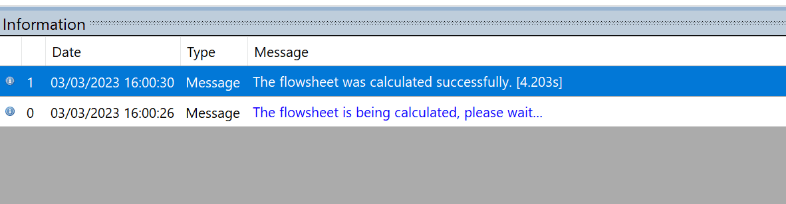

*A DWSIM’s calculator message.*

##### Results

Results can be viewed in reports, generated (Figures [26](#fig:figura-relat) and [27](#fig:figura-relat2)) for printing. Report data can also be saved to ODT, ODS, XLS, TXT or XML files.

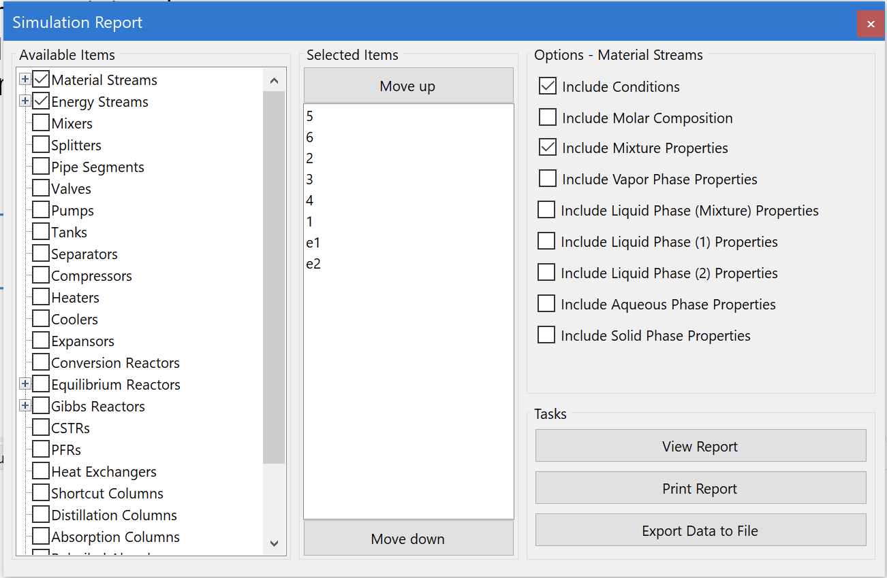

*Results report configuration.*

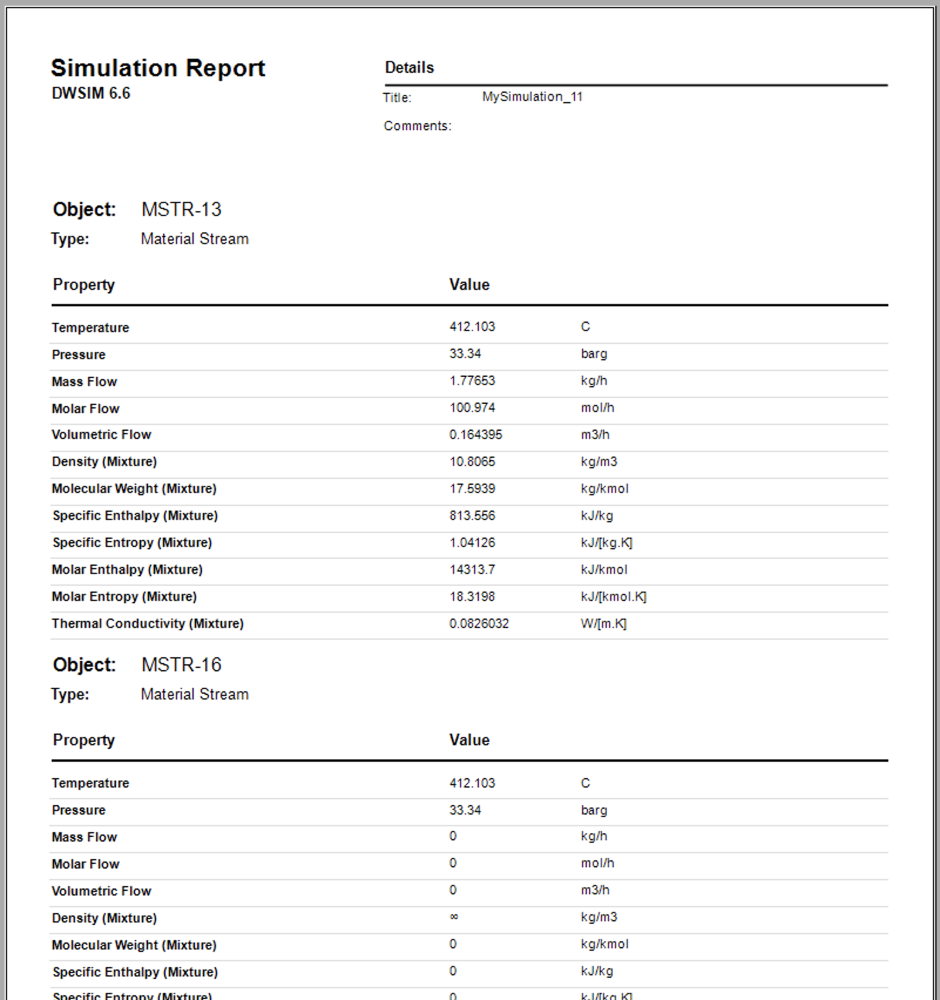

*Results report.*

#### Sensitivity Study

The Sensitivity Study utility performs parametric sweeps over up to two independent variables to evaluate their effect on one or more dependent flowsheet variables. Each independent variable is swept over a user-defined range at equally spaced points. For example, sweeping temperature from 200 to 400 K in 9 points and pressure from 100 to 1000 kPa in 5 points produces a 9 x 5 = 45-point grid, with the entire flowsheet re-solved at each grid point. The total computation time scales linearly with the number of grid points, so large grids should be used judiciously.

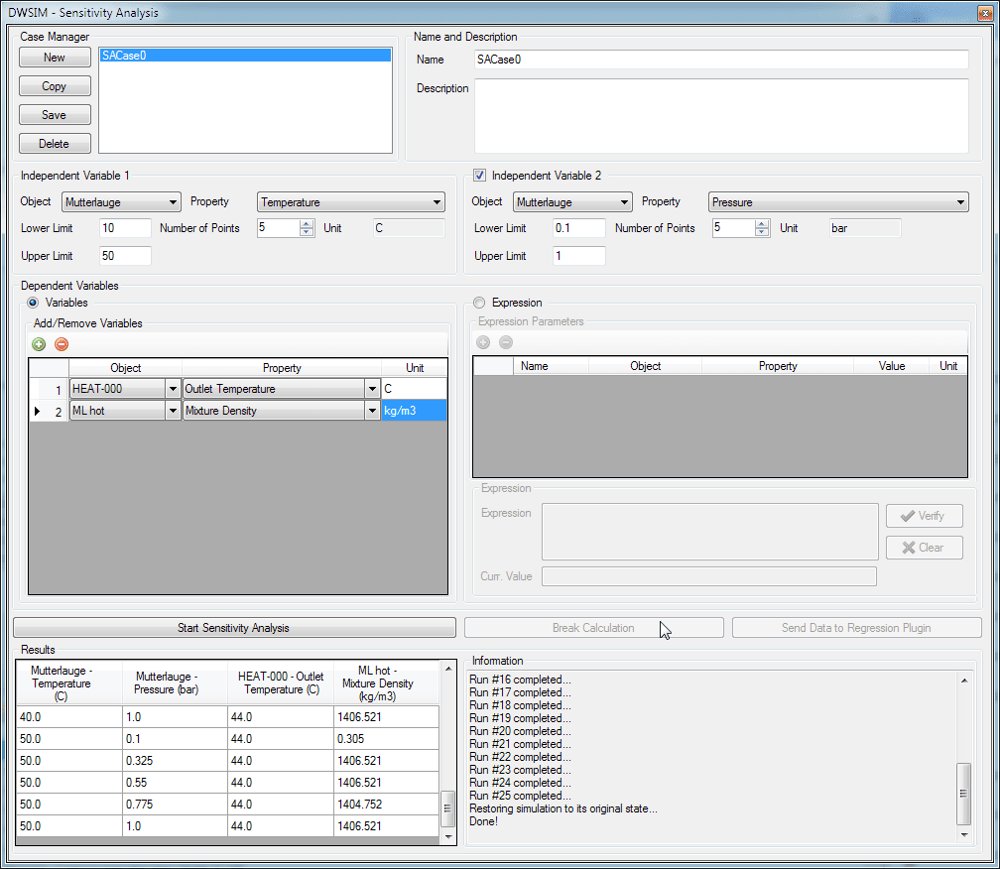

*Sensitivity Analysis Utility (1).*

The sensitivity analysis utility is based on case studies. In a single simulation one can define a number of cases, each one with its own variables, ranges and results. These cases will be saved together with the simulation, and cannot be exported to other ones. The results are shown in a table, so the data can be copied and pasted into another specialized data analysis software or sent directly to the data regression plugin.

#### Flowsheet Optimization

The Multivariate Optimizer in DWSIM handles single and multivariate optimization problems with or without bound constraints. The objective function can be either a variable in the flowsheet or an expression as a function of as many variables as you need.

The interface is very similar to Sensitivity Analysis’s one. One can define a number of cases, each one with its own variables, ranges and results. These cases will be saved together with the current simulation, and cannot be exported to other simulations.

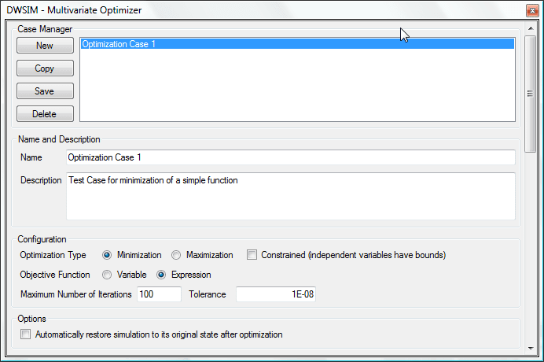

*Multivariate Optimization Utility (1).*

The optimizer supports minimization or maximization of an objective function, which can be either a single flowsheet variable or a user-defined expression involving multiple flowsheet variables. Independent variables may be bounded (box constraints). Convergence is controlled by a maximum iteration count and a tolerance on the change in the objective function value between successive iterations. An option to restore the flowsheet to its original state after optimization is available, so that the optimized results are reported only in the optimizer window without permanently altering the flowsheet.

In order to define variables to be used in the optimization process, a variable can be added by clicking on the "+" button. With the variable row added to the list, one chooses an object, then the desired property and the type of variable (IND for independent, AUX for auxiliary or DEP for dependent variables). If necessary, one can define a lower and/or upper limit for the IND variables, according to the current unit system. The variable name is the one which will be used in the expression.

DWSIM only considers bounds for independent variables. Also, if the objective function is a DEP variable, and you defined multiple DEP variables, only the first one will be used. AUX variables are used by an expression when the objective function is set to evaluate the expression. To remove a variable, a row must be selected by clicking at the row header before pressing the "-" button.

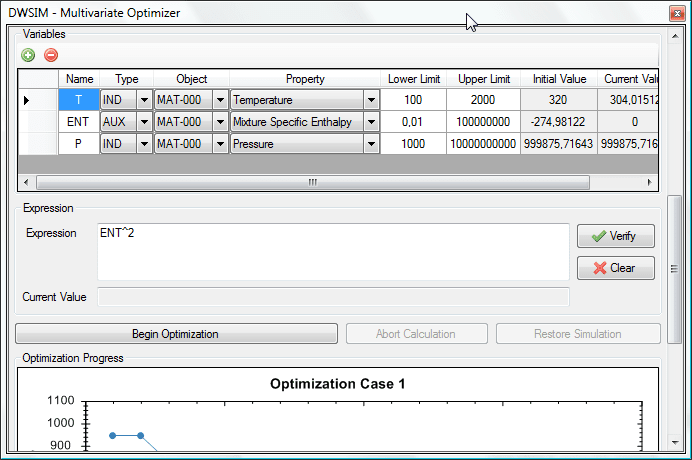

*Multivariate Optimization Utility (2).*

With all the variables defined and the case configured, the optimization can be carried out by clicking on the appropriate button - the button will become disabled. After some time, if the optimization converges, the button will become active again, indicating that the the optimization process is over.

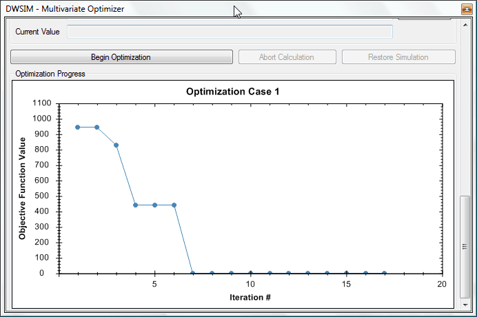

*Multivariate Optimization Utility (3).*

#### Mass and Energy Balance Summary

You can find the **Mass and Energy Balance Summary tool** in the Flowsheet Analysis menu:

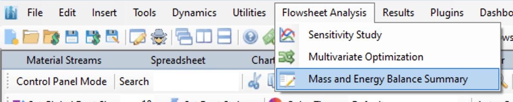

*Mass and Energy Balance Summary tool location.*

This tool gives you an overall view of the equipments and their energy consumption/generation, as well as the defined or calculated efficiencies, if applicable. There is also a list of all material streams and their associated energy flows (in SI, energy flow = enthalpy x mass flow = kJ/kg x kg/s = kJ/s = kW).

At the bottom of the tool window, you’ll find the overall flowsheet mass balance residue and total flowsheet energy consumption/generation.

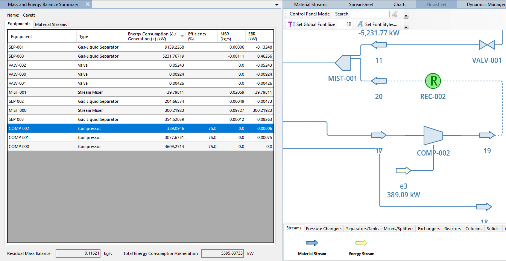

*Mass and Energy Balance Summary tool.*

#### Utilities

DWSIM includes some utilities which provides the user with more information about the process being simulated.

Utilities can be added and attached to Flowsheet objects (**Utilities \> Add Utility** menu item). After being attached, they will be saved together with simulation data and restored upon reopening. Some data from the attached utilities will be available to be displayed on property tables and used on sensitivity analysis and optimization studies.

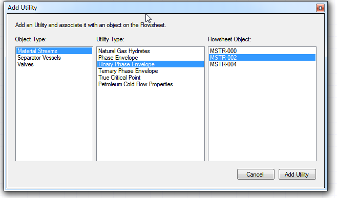

*Attaching Utilities through the "Add Utility" window.*

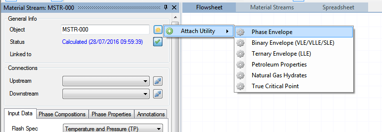

*Attaching Utilities through the object editors.*

Added/Attached Utilities will be visible on the context menu located on the object editors, on the right of the Object’s Name textbox.

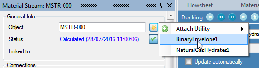

*Accessing attached Utilities.*

- ***True Critical Point*** - utility to calculate the true critical point of a mixture (Figure [35](#fig:figura-utPCV)).

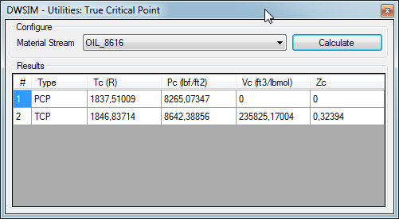

*Utilities - True Critical Point.*

- ***Phase Envelope*** - Material stream phase equilibria envelope calculation (Figure [36](#fig:figura-utDF));

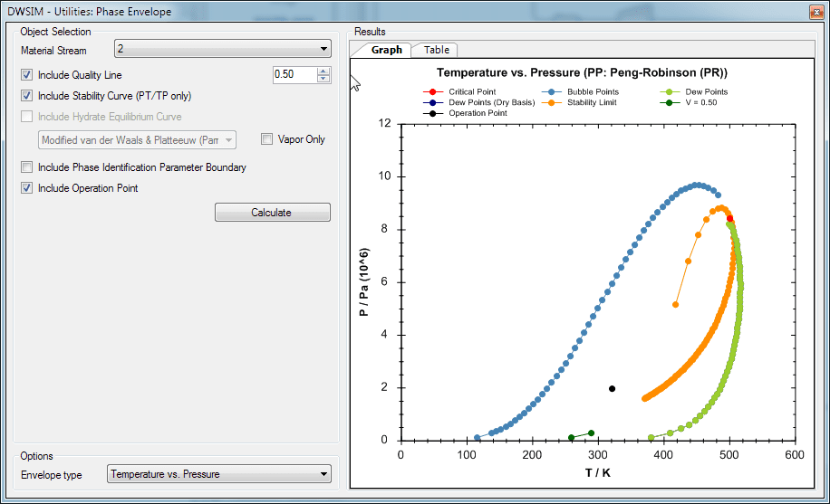

*Utilities - Phase Envelope.*

- ***Binary Envelope*** - special envelopes for binary mixtures (Figure [37](#fig:figura-utDB)).

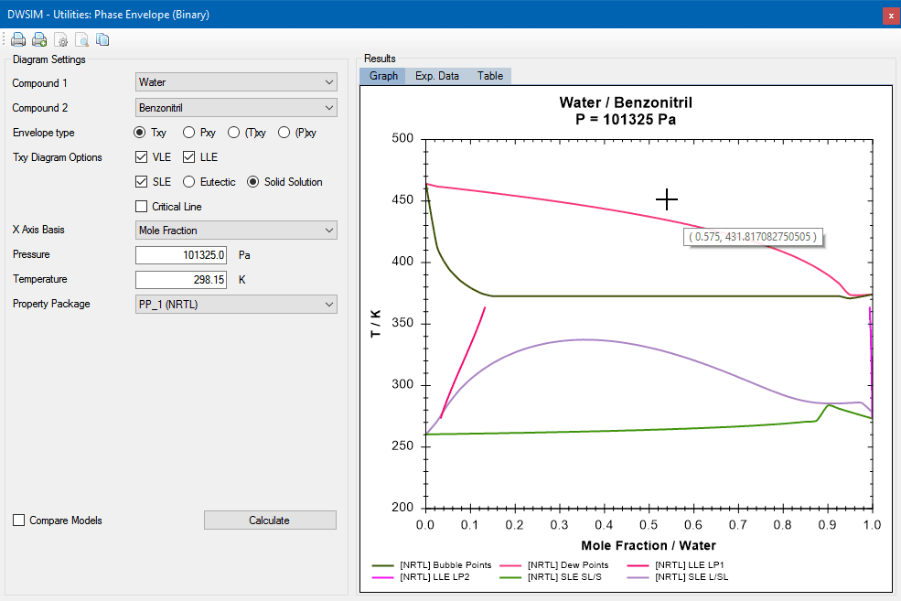

*Utilities - Binary Envelope.*

- ***Petroleum Cold Flow Properties*** - special properties of petroleum fractions, like cetane index, flash point, refraction index, etc. (Figure [38](#fig:figura-utDB-1)).

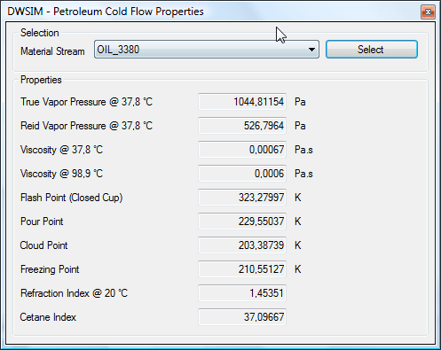

*Utilities - Petroleum Cold Flow Properties.*

Utilities calculate their properties for one object only, which is selected inside their own windows. In the majority of cases, this object must be calculated in order to be available for selection in the utility window.

> 
>
> | *image* | *Please view DWSIM’s Technical Manual for more details about the models and methods used by the Utilities.* |
> |:---|:--:|

#### Chemical Reactions

DWSIM classifies chemical reactions in three different types: Conversion, where the conversion of a reagent can be specified as a function of temperature; Equilibrium, where the reaction is characterized by an equilibrium constant K, and Kinetic/Heterogeneous Catalytic, where the reaction is led by a velocity expression which is a function of concentration of reagents and/or products and/or a catalyst.

> 
>
> | *image* | *Please view DWSIM’s Technical Manual and Equipment and Utilities Guide for more details about chemical reactions and reactors, respectively.* |
> |:---|:--:|

Chemical reactions in DWSIM are managed through the **Chemical Reactions Manager** (**Simulation Settings \> Reactions** panel) (Figure [39](#fig:Chemical-Reactions-Manager.)):

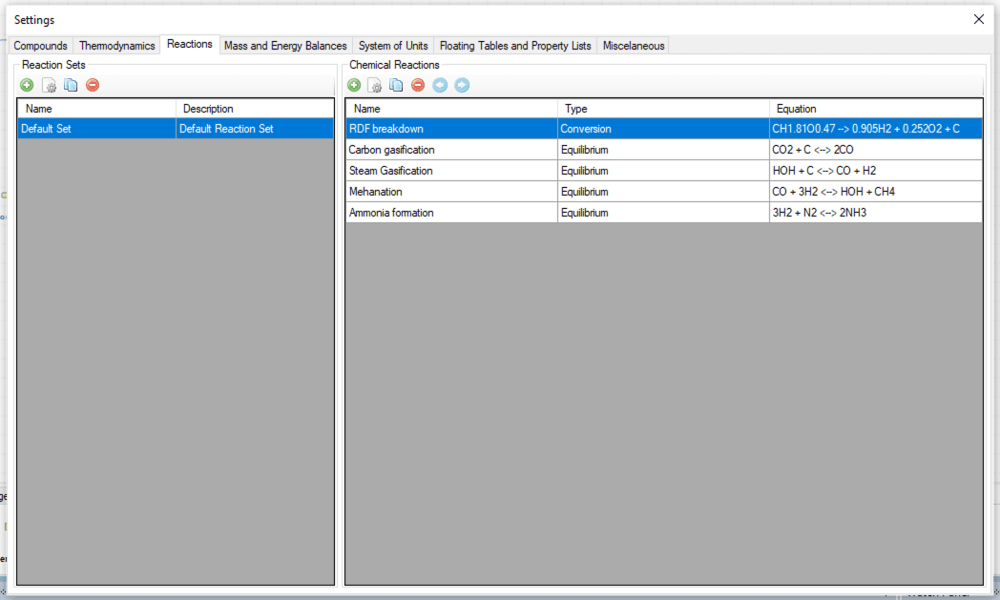

*Chemical Reactions Manager.*

The user can define various reactions which are grouped in *Reaction Sets*. These reaction sets list all chemical reactions, and the user must activate only those he/she wants to become available for one or more reactors, since the reactor’s parameter is the **reaction set** and not the chemical reactions themselves. In the reaction set configuration window it is also possible to define the reaction ordering. Equal indexes define parallel reactions (Figure [40](#fig:Reaction-Set-editor.)):

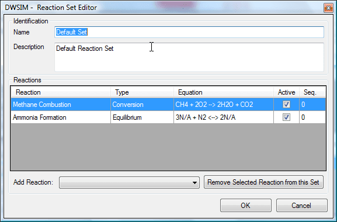

*Reaction Set editor.*

When the reactions and their respective reaction sets are correctly defined, the sets will be available for selection in the property window of a reactor in the simulation. When requested for a calculation, the reactor will then look for active reactions inside the selected set.

#### Characterization of Petroleum Fractions

DWSIM provides three tools for characterization of petroleum fractions. One of them characterizes C7+ fractions from bulk properties (Figure [41](#fig:figura-ps1)). The other characterizes the oil from an ASTM or TBP distillation curve (Figure [42](#fig:Characterizing-petroleum-from)). There is also a tool to create pseudocompounds from tabular data.

####### ***- Characterization from bulk properties*** {#characterization-from-bulk-properties .unnumbered}

The method itself requires a minimum of information to generate the pseudocomponents, though the more data the user provides, the better will be the results (Figure [41](#fig:figura-ps1)). It is recommended that the user provides the specific gravity of the C7+ fraction at least. Viscosity data is also very important.

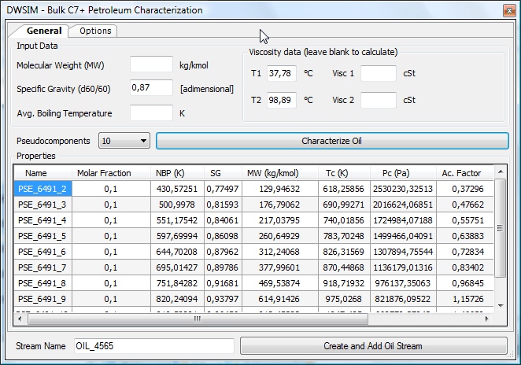

*C7+ petroleum fraction characterization utility.*

####### ***- Characterization from distillation curves*** {#characterization-from-distillation-curves .unnumbered}

This tool gets data from an ASTM or TBP distillation curve to generate pseudocomponents. It is also possible to include viscosity, molecular weight and specific gravity curves to enhance the characterization.

The interface has a wizard-like style, with various customization options (Figure [42](#fig:Characterizing-petroleum-from)):

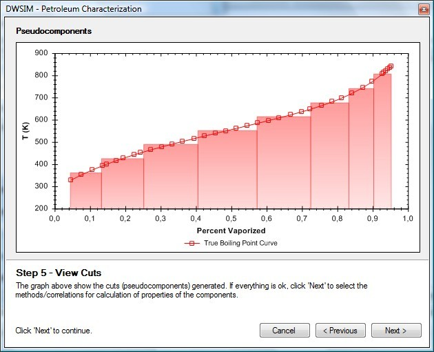

*Characterizing petroleum from distillation curves.*

After the pseudocomponents are created, a material stream with a defined composition is also created, which represents the characterized petroleum fraction.

> 
>
> | *image* | *The hypo and pseudocomponents are available for use only in the simulation in which they were generated, even if there is more than one opened simulation in DWSIM. Nevertheless, the user can export these components to a file and import them into another simulation.* |
> |:---|:--:|

####### ***- Bulk/Batch creation of pseudocomponents/pseudocompounds*** {#bulkbatch-creation-of-pseudocomponentspseudocompounds .unnumbered}

The Bulk Create Pseudocompounds tool can be used to create pseudocompounds in a batch when you have the required data in a tabular format, or only part of the data. If some data is missing, DWSIM can estimate it before exporting the compounds to XML, JSON or add them to the Flowsheet (Figure [43](#fig:figura-ps1-1)).

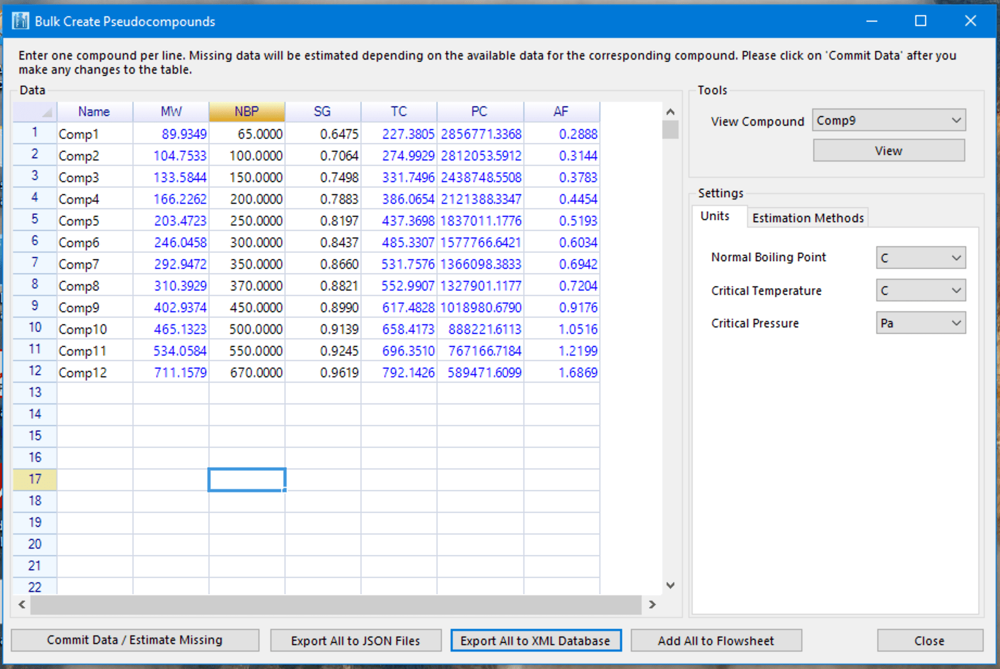

*Bulk creation of pseudocomponents/pseudocompounds.*

####### ***- Contaminant and PNA composition on pseudocomponents*** {#contaminant-and-pna-composition-on-pseudocomponents .unnumbered}

Starting with DWSIM 8.9, every generated pseudocomponent can carry a *contaminant vector* (total and mercaptan sulfur, nitrogen, Ni/V/Fe/Na, Conradson carbon, asphaltenes, TAN) and a *paraffin/naphthene/aromatic (PNA) triplet.* These optional properties are stored on the compound constants alongside molecular weight, specific gravity and NBP, and are propagated through the flowsheet by every refining unit operation (see the Refining Unit Operations chapter).

- **Bulk properties (C7+)** — the corresponding tool ( *FormPCBulk*exposes three optional fields for the bulk paraffin, naphthene and aromatic mass fractions. When provided, each generated pseudocomponent receives the same PNA triplet, renormalised to unity.

- **Distillation curves** — the Distillation Curve Characterization wizard adds three optional columns ( *xP* *xN* *xA* in the assay grid. When at least two temperature-indexed points are entered, the PNA composition is interpolated at each pseudocomponent mean boiling point using the same barycentric (Floater–Hormann) scheme already used for molecular weight and specific gravity curves.

- **Bulk creation** — the Bulk Create Pseudocompounds grid accepts per-row PNA columns and an optional contaminant block; missing values are left empty (and simply ignored by downstream units).

PNA-aware refining blocks (Reformer, Isomerization, FCC, HCR, HDS, Coker) aggregate the feed PNA composition as a mass-weighted mean over petroleum-fraction compounds that have a triplet set, and use it to modulate yields and hydrogen/coke consumption. If no feed pseudocomponent carries PNA data, the PNA correction is bypassed and the baseline (PNA-independent) yield slates are used, so the enhancement is strictly additive with respect to pre-8.9 behaviour.

