# Compound Creator

#### Introduction

The new Compound Creator Utility is an all-in-one replacement for the User Compound and Hypothetical Creator utilities in DWSIM. It enables usage of experimental data as well as UNIFAC structure information to calculate and/or estimate all constant and temperature-dependent properties for a compound that isn’t available on any of the default databases (DWSIM and ChemSep).

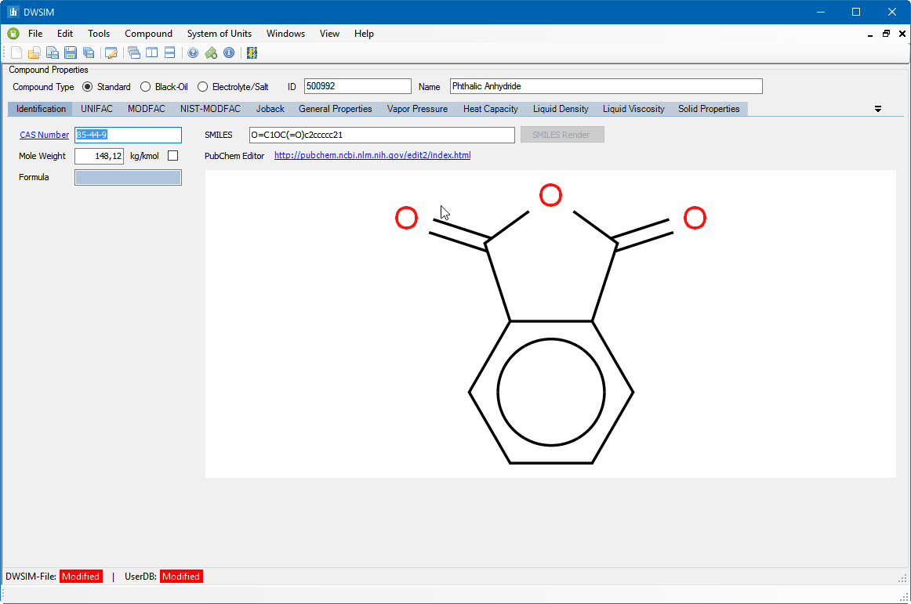

To open the utility, you can use the corresponding button on the Welcome screen or go to File \> New \> Compound Creator Study.

#### Data Input Constant Properties

Enter an unique ID for the compound. It can be any integer number (a random 5-digit integer is ok). Enter a name for the compound.

DWSIM makes it easier to calculate most properties if you enter some UNIFAC structure information. With UNIFAC structure info, DWSIM will calculate all properties that have its adjacent checkbox checked. Nothing stops you from entering your own value on these textboxes, but if the checkbox is checked and you change the UNIFAC structure info, DWSIM will update the value with its own calculation.

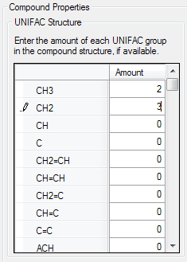

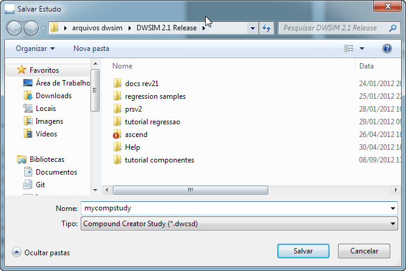

Property textboxes that have a blue background are not essential, but are required if you’re planning to use your compound in a simulation with PC-SAFT, Chao-Seader and/or Grayson-Streed models, for example.

#### Temperature-dependent Properties

By default, temperature-dependent properties will be calculated by internal DWSIM routines, but if you have some tabulated data available, you can use it to make DWSIM generate coefficients and use them instead.

For instance, let’s say that you have some liquid density data available. You can input it on the Liquid Density table (just make sure that the current units are the same as yours) and click on "Regress". DWSIM will let you know if anything went wrong during the regression on the textbox below the buttons.

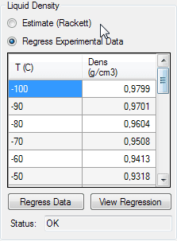

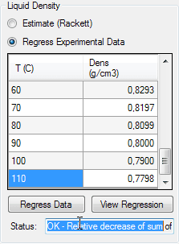

To view the regressed data, click on "View Regression". You should see your points and a line representing the fitted equation that will be used by DWSIM on your simulations.

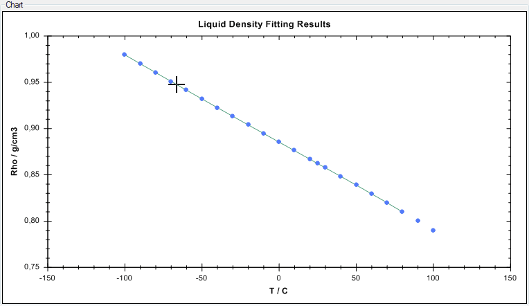

#### Importing Data from Online Sources

You can import compound data from some online sources like the Cheméo Database. Go to Compound \> Import Data from Online Sources and explore the available options.

After you finish importing data from the online sources, any data previously input on the textboxes will be overriden for the properties you’ve selected.

#### Importing Pure Compound Data from NIST ThermoML

DWSIM ships with an offline cache of pure-compound experimental data extracted from the NIST ThermoML Archive. This gives you a fully-populated compound (critical properties, normal boiling and melting points, enthalpy of fusion, ideal-gas heat capacity and vapor-pressure correlations) without needing an internet connection or a Cheméo account.

The importer is launched from two places: the Simulation Setup Wizard (**Import from ThermoData** button next to the existing **Import Online** button) and from **Settings \> General Settings \> Compounds** on an already-loaded simulation.

Type a name, CAS number or InChIKey in the search box and pick a compound from the results list. The importer then:

1.  Gathers every ThermoML record for the selected compound from the local LiteDB cache, across all sources, and picks the best record per property (preferring source-provided fits, then more data points, then the most recent publication).

2.  For properties present only as (T, value) point sets, fits a DIPPR-101 equation for vapor pressure where enough points are available.

3.  If the record does not carry a SMILES string (common for ThermoML), resolves one from PubChem using the compound’s InChIKey, CAS number or name.

4.  Fragments the SMILES into Joback, UNIFAC and Modified UNIFAC (Dortmund) groups automatically.

5.  Fills any remaining gaps via an estimator chain: Joback for critical properties, boiling/melting points, formation energetics, heat of fusion and ideal-gas Cp; Lee-Kesler for the acentric factor; Rackett for liquid density. Vapor pressure, when not provided or fitted, falls back at runtime to DWSIM’s built-in Lee-Kesler Pvp correlation.

Experimental values from ThermoML are always prioritized over estimated values. The **Comments** field of the resulting compound is populated with a provenance block listing, per property, whether the value came from a source (with DOI citation), a local curve fit, or which estimator produced it. This lets you audit the origin of every number after the compound is added to your simulation.

The offline bundle is downloaded automatically from a public mirror the first time the importer is used and is stored under` %LOCALAPPDATA%/DWSIM/PureCompound` (or the XDG equivalent on Linux/macOS). Subsequent searches hit the local database only.

#### Creating the Compound

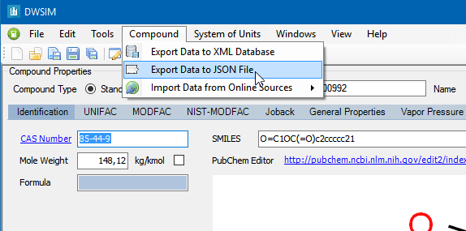

If everything is ok, you can save your compound data to a XML database file. Go to Compound \> Export Data to XML Database. The XML database has the advantage of handling multiple compounds in a single file.

You can also export your compound to a single JSON file. The JSON file format is very easy to edit if you need to:

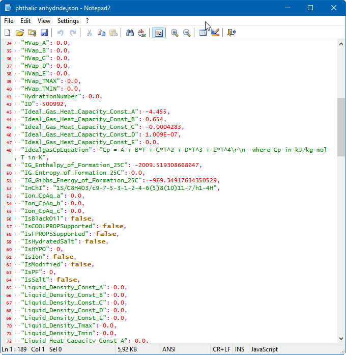

You can also save your compound creator data to a file if you think you’ll need to change it later, or use it as a starting point for another compound (File \> Save As):

#### Adding the Compound to a Simulation

##### Loading Compounds from XML Databases

To load your compound into a simulation, go to Settings \> General Settings \> User-Defined Datasets and click on Add User Dataset. Select your XML database file and click Open. Create a new simulation and check if your compound is on the list (it should be the last one):

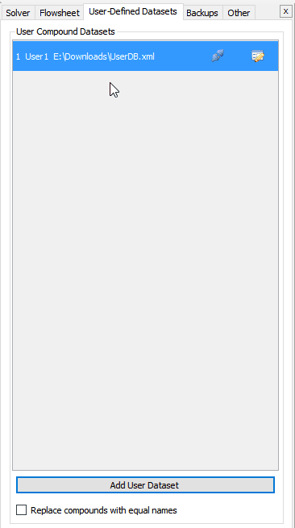

##### Loading Compounds from JSON files

You can load a compound from a JSON file directly through the Compounds section in the Simulation Configuration Wizard and in the Simulation Settings Panel.

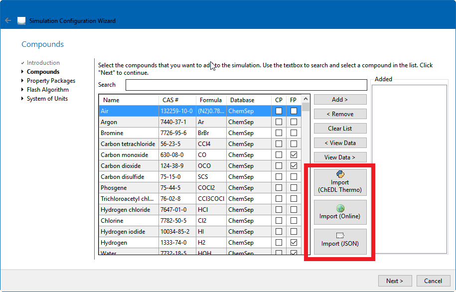

##### Remarks

When you add your compound to the simulation, you can use the Pure Compound Property Utility to edit the data, but those changes will be made only for the current simulation. If you need to make perpertual changes, you’ll have to use the Compound Creator Utility to save your compound, or edit the XML or the JSON file directly and reload it.

If you input tabulated liquid density data to create an experimental curve, remember to activate the "Use Experimental Liquid Density Data" option on the Property Package configuration window, otherwise DWSIM will use the Rackett correlation for liquid density estimations.

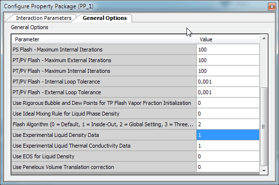

