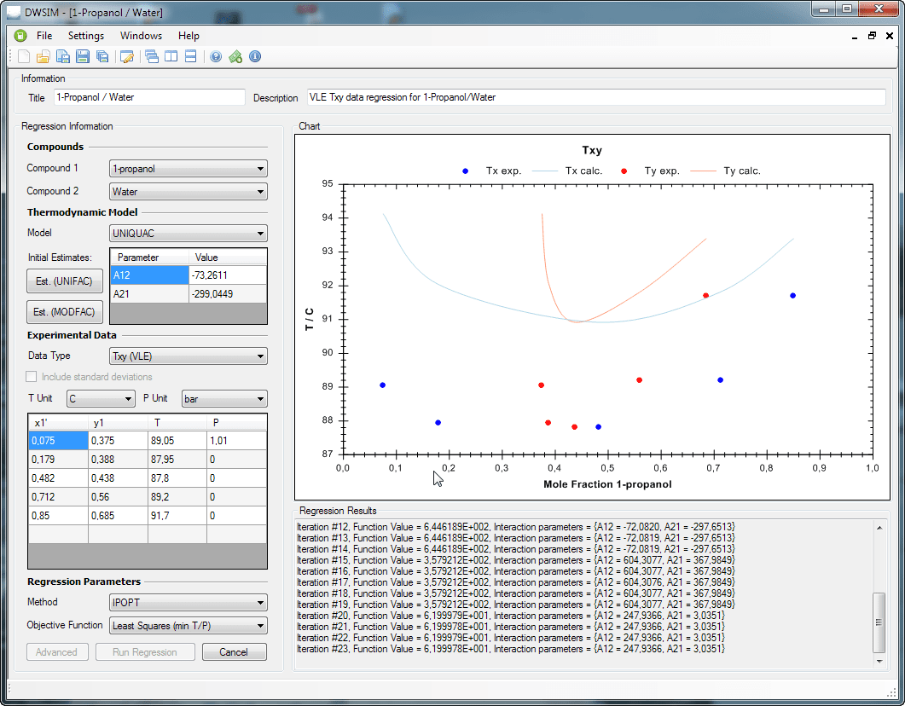
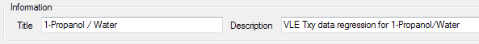
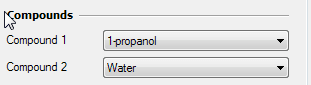
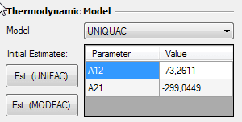
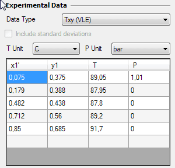
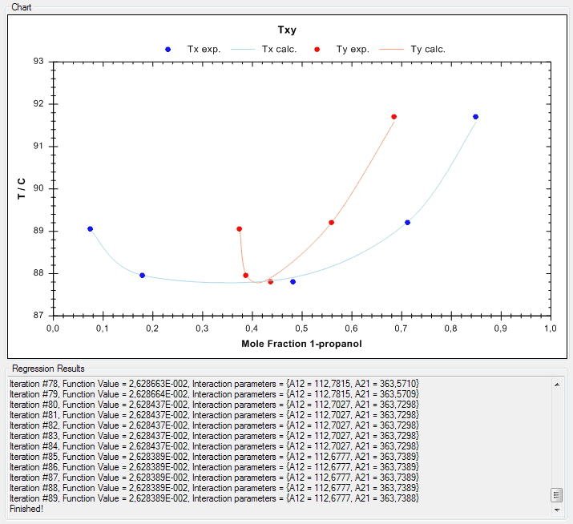
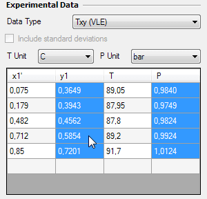
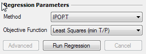
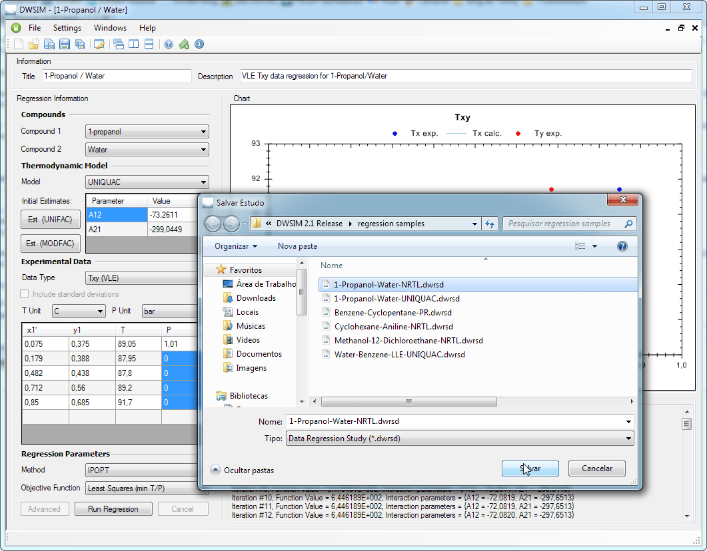

# Data Regression

The Data Regression Utility supports regression of experimental binary data for determination of interaction parameters for the following models:

- PC-SAFT

- Peng-Robinson

- Peng-Robinson-Stryjek-Vera 2

- Soave-Redlich-Kwong

- UNIQUAC

- NRTL

- Lee-Kesler-Plöcker

The following data sets are supported:

- VLE Temperature and mole fractions (Txy)

- VLE Pressure and mole fractions (Pxy)

- VLE Temperature, Pressure and mole fractions (TPxy)

- LLE Temperature and mole fractions (Txx)

- LLE Pressure and mole fractions (Pxx)

- LLE Temperature, Pressure and mole fractions (TPxx)

The Data Regression Utility also has some handy additional features like:

- Calculation of initial values for the binaries using UNIFAC/MODFAC structure information

- Calculation of missing experimental data using known models/binaries for determination of parameters for other models

- Optimization method selection

- Objective Function selection (Least Squares of temperature/pressure plus vapor fractions)

The Data Regression Utility also supports loading and saving of a regression study/case for later use. Currently, there is no way to export the generated binaries for a simulation or a database - you’ll have to do this manually.

#### Data Regression - How To

In this example we will regress Txy experimental data for determination of UNIQUAC interaction parameters for the 1-Propanol/Water binary.

####### Title and Description

Enter a title and a description for you regression case.

####### Compound Selection

Select the compounds 1-Propanol and Water on the corresponding combo boxes.

####### Model Selection

Select UNIQUAC in the combobox for the Thermo Model. In the table below you can input your own initial estimates for the binaries, in order to help the optimizer on finding the values that minimize the difference between calculated and experimental values. You can also use the UNIFAC structure information to estimate initial values through UNIFAC and/or Modified UNIFAC models.

If the ***Use Ideal Vapor Phase Model*** is checked, DWSIM will calculate the vapor phase fugacities using the ideal model ( $\phi=1$ ), otherwise it will do it using the Peng-Robinson EOS.

####### Experimental Data Input

In the ’Experimental Data’ section, select your data type (Txy), and the units for Temperature and Pressure. x1, x2 and y1 will always be in mole fractions.

Input your experimental data in the table below. If you selected the Txy data type, the pressure only needs to be informed on the first cell of the corresponding column. The same applies for Pxy data, you’ll input all pressures and the temperature only has to be informed on the first cell.

####### Clearing cell and rows

DWSIM will only accept the last line as a blank one. If you want to remove data from the table, press the "Del" key after selecting the cells that you want to clear. To remove an entire row, select all cells on the row and press "Shift+Del".

####### Calculating missing data

DWSIM can "complete" your experimental data set by using models with known interaction parameters. Say, for example, that you want to add a few data pairs but you only have the liquid phase mole fraction and pressure information. In this case you can use DWSIM to estimate the missing vapor phase mole fraction and temperature.

To estimate the missing data, just select the corresponding cells and click with the right mouse button, selecting the model that you want to use to calculate the values. DWSIM will then fill the selected cells with the calculated data.

####### Regress data

In the "Regression Parameters" section, select the optimization method from the "Method" combobox and the Objective Function from the corresponding combobox. Currently, only the Least Squares obj. function is available. Here, You’ll have the follwing options:

- Least Squares (min T/P): minimizes the difference between calculated and experimental pressures/temperatures ONLY

- Least Squares (min y): minimizes the difference between calculated and experimental vapor phase mole fractions ONLY

- Least Squares (min T/P+y): minimizes the difference between calculated and experimental pressures/temperatures plus vapor phase mole fractions

  

Now click on "Run Regression". DWSIM will then run the optimizer in order to find the optimum values for the binaries using the data you provided. DWSIM will tell you when it is done, and after that you can save your regression case for later use.

IMPORTANT: the calculated interaction parameters are not copied to the BIP databases - their values are only "shown" in the results textbox. You’ll have to input them manually on your simulation.

DWSIM Data Regression files have the ".dwrsd" file extension.

#### Searching for Binary Phase Equilibrium Data

The Data Regression utility includes a built-in search for binary phase-equilibrium experimental datasets, backed by an offline cache of NIST ThermoML mixture data. Open it from the Data Regression window via **Search Online \> Search ThermoML Archive**.

You can query by one or two compound identifiers (name, CAS number or InChIKey), and optionally filter by data type (VLE / LLE / SLE), measurement method (static cell, ebuliometer, headspace GC, DSC, etc.) and temperature or pressure range. Results are ranked by number of experimental points so that the most informative datasets appear first.

Each result shows the component pair, phase-equilibrium type, number of points, T/P ranges, measurement method, and the full Crossref-enriched bibliographic citation (authors, journal, year, DOI). Double-clicking a result loads the full set of experimental points — temperature, pressure, liquid-phase mole fractions (x) and, for VLE datasets, vapor-phase mole fractions (y) — directly into the regression grid, ready for parameter fitting with any of the supported thermodynamic models (PC-SAFT, Peng-Robinson, PRSV2, SRK, UNIQUAC, NRTL, Lee-Kesler-Plöcker).

As with the pure-compound importer, the underlying LiteDB archive is cached locally under` %LOCALAPPDATA%/DWSIM/PhaseEquilibrium` and downloaded on first use. Searches are fully offline after that.

