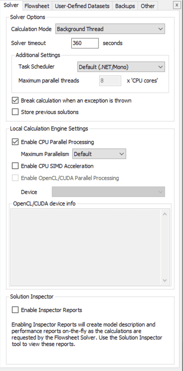
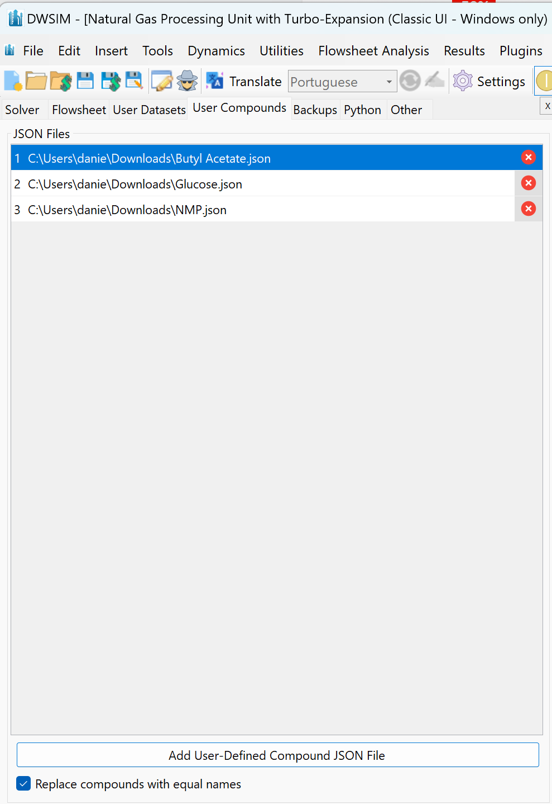

# General Settings

The application settings can be accessed through the **Edit \> General Settings** menu item (Figure [44](#fig:generalconfig1)):

*General Settings section.*

#### Solver

The Solver configuration tab display a group of settings to control the behavior of DWSIM’s solver. Check the Wiki article[Solver Configuration](http://dwsim.inforside.com.br/wiki/index.php?title=Solver_Configuration)for more details.

#### Flowsheet

##### Cut/Copy/Paste Flowsheet Objects

- **Compounds**: controls how compounds are handled during cut/copy/paste operations.

- **Property Packages**: controls how Property Packages are handled during cut/copy/paste operations.

##### Undo/Redo

- **Recalculate flowsheet**: defines if the flowsheet is to be recalculated after undo/redo operations.

##### Object Editors

- **Enable multiple editors**: allows displaying of multiple object editors at once.

- **Close editors on deselecting**: closes the editors once the object being edited is deselected.

- **Default initial placement**: default location for displaying the object editors.

#### User Datasets

In the database tab, you have options to remove, add and edit user-defined compound and interaction parameter datasets.

#### User Compounds

Add references to JSON files containing pure compound data, so they are available on startup for all existing and new flowsheets:

#### Backup

The Backup tab has options to control the frequency of the backup file saving. You can also configure the option to save an existing file with another name instead of overwriting it.

#### Other

##### Messages

- **Show tips**: displays context-sensitive tips on the flowsheet information (log) window.

- **Show ”What’s New”**: displays a window with information about what’s new on the running version.

##### Debug mode

- **Debug level**: controls the amount of information written to the flowsheet information (log) window when solving the simulation.

- **Redirect console output**: redirects the output of the console to the console window inside DWSIM.

##### UI Language

- **Language**: sets the UI language. Requires a restart.

##### CAPE-OPEN

- **Remove solid phases...**: This is for ChemSep compatibility. If enabled, DWSIM will hide the solid phase in Material Streams from CAPE-OPEN Unit Operations.

##### Compound Constant Properties

- **Ignore compound constant properties...**: If enabled, this will prevent DWSIM from using compound constant data from the loaded simulation files and use the data from the compound databases themselves.

##### DWSIM/Python Bridge Settings

- **Python Binaries Path**: Set the path where the GNU Octave binaries are located. This is only required if you’re running DWSIM on Windows.

- **Python Process Timeout**: Set the timeout for the Octave processes, in minutes.

