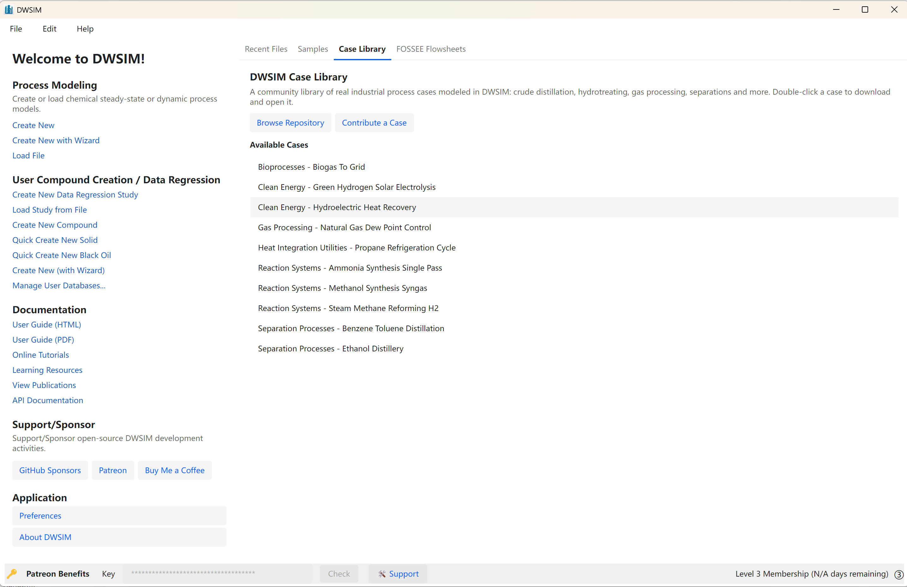
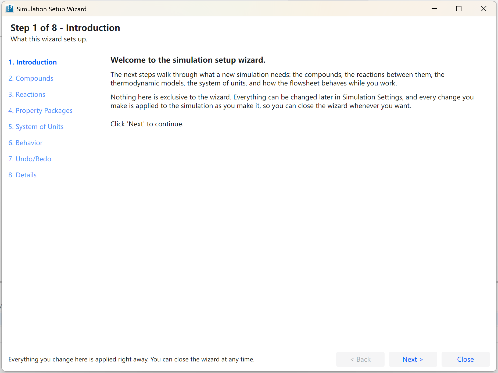

# Main Interface

#### Welcome Screen

DWSIM opens on a welcome screen. It lives in the same window as the simulations themselves: it is replaced by the first simulation you create or open, and it comes back when the last one is closed.

The left-hand column groups everything that can be done before a simulation exists:

- **Process Modeling** - Create New, Create New with Wizard, Create New with AI Assistant, and Load File.

- **User Compound Creation / Data Regression** - create a new data regression study or load one from a file, create a compound by hand, quick-create a solid, or start the compound creation wizard.

- **Documentation** - this user guide in HTML and PDF form, the online tutorials, the learning resources, the list of publications and the API documentation.

- **Support/Sponsor** - GitHub Sponsors, Patreon and Buy Me a Coffee.

- **Application** - Preferences and About DWSIM.

The right-hand side has three tabs:

- **Recent Files** - the last fifteen simulations that were opened, most recent first. Double-click one to open it. The list can be emptied from File \> Open Recent \> Clear List.

- **Samples** - the sample simulations shipped with DWSIM.

- **FOSSEE Flowsheets** - the flowsheets contributed to the FOSSEE Flowsheeting Project. Double-clicking one downloads it and opens it.

*The DWSIM welcome screen.*

#### The Simulation Window

Simulations are opened as tabs of a single window, not as separate windows. The tab that is in front supplies the menu bar, the toolbars and the panels, and the window title shows its name. A tab can be dragged out of the window when you want two simulations side by side, and dropped back in afterwards. Closing a tab asks for confirmation, because unsaved changes are lost.

A new simulation starts with an empty flowsheet and the **Simulation Setup Wizard** on top of it.

*A new simulation with the Simulation Setup Wizard.*

#### Panels

The simulation window is a set of dockable panels. Any of them can be resized, moved to another edge, stacked as a tab next to another panel, or pinned so that it collapses to a strip when it is not in use. The default arrangement is:

- **Editor** (left) - the property editor of the object selected on the flowsheet, with tabs for Connections, Properties, Custom Properties, Dynamics, Results and Appearance. Only the tabs that apply to the selected object are shown.

- **Flowsheet** (centre) - the process flow diagram.

- **Results** (centre) - the list of flowsheet objects, with a property grid and a text report for the selected one.

- **Material Streams** (centre) - one column per material stream and one row per property. The specified properties of feed streams can be edited directly in this grid.

- **Spreadsheet** (centre) - a spreadsheet whose cells can read from and write to the flowsheet.

- **Dynamics Manager** (centre) - event sets, cause-and-effect matrices, integrators and schedules.

- **Objects** (right) - the object palette, grouped by category. Objects are added by dragging them onto the diagram or by double-clicking them.

- **Log** (bottom) - solver and application messages, newest first.

- **Integrator Controls** (bottom) - runs a dynamic simulation schedule.

The panels are shown and hidden from the **View** menu. Their arrangement is saved inside the simulation file, so a flowsheet re-opens with the layout it was saved with. The Classic UI keeps its own layout in the same file, and neither interface disturbs the other’s.

#### Menus and Toolbars

The menu bar belongs to the simulation that is in front:

- **File** - new, open and recent files, save and save as, export the flowsheet as a PNG image, an SVG drawing or a PDF file, and close.

- **Edit** - undo and redo, the clipboard and selection commands, clone and disconnect, and the two configuration windows: Simulation Settings (Alt+M) and General Settings (Alt+G).

- **Solver** - Solve (F5), Force Solve and Abort, plus the Flowsheet Calculator Active (F6) and Simultaneous Adjust Solver (F7) switches.

- **Insert** - material and energy streams, property tables, master property tables, spreadsheet tables, charts and text blocks.

- **Tools** - the unit operation extension manager, the compound creation and petroleum characterization tools, the reaction manager, data regression, the script manager, the systems of units editor, the inspector reports and the AI tools.

- **Dynamics** - the dynamic mode switch, the dynamics manager, the integrator controls and the PID controller tuning tool.

- **Utilities** - the stand-alone calculations described later in this part.

- **Flowsheet Analysis** - sensitivity analysis, the multivariate optimizer, the mass and energy balance summary and the property chart.

- **Results** - the Markdown report viewer.

- **Plugins** - the plugins found in the plugins folder next to the application.

- **View** - show or hide the Editor panel, the Object Palette, the Log panel and the sub-toolbar, close all open editors, and the zoom commands.

- **Help** - the user guide, support, bug reporting and the About window.

Installed extensions add their own entries to the File, Edit, View, Tools, Utilities, Dynamics, Results and Help menus, according to the category each one declares.

The main toolbar under the menu is divided into groups: save and simulation settings; the steady-state solver, with the calculator switch, Force Solve, Solve and Abort; undo and redo; the dynamics solver; the **flowsheet states**, where the current solution can be stored under a name, restored later or removed; and the zoom, connect, delete and inspector commands.

A second toolbar, hidden by default and turned on from View \> Show Sub-Toolbar, carries the Grid, Snap and Multi-Select switches, the eight alignment and spacing commands, and a box that finds an object by its name and brings it into view.

The status bar at the foot of the window reports the last action on the left and the current zoom level on the right.

#### Appearance

The look of the application is set in the **Interface** tab of the Preferences window:

- **Theme** - Light, Dark or System default. Light and Dark are remembered between sessions and are applied from the splash screen onwards.

- **Scaling Factor** - between 0.2 and 3.0, for high-density displays. It takes effect the next time DWSIM starts.

- **Culture** - English, Portuguese (Brazil), German, Spanish, Russian, French and Simplified Chinese.

The font sizes used by the object editors and by the text reports are on the **Flowsheet** tab of the same window.

