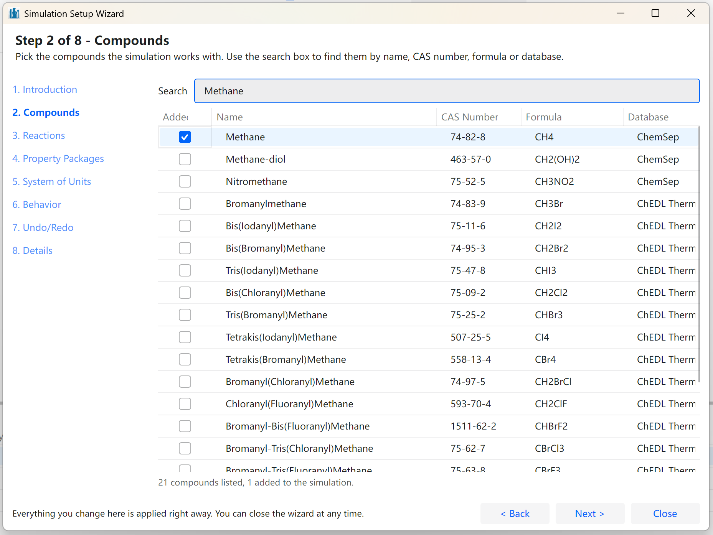
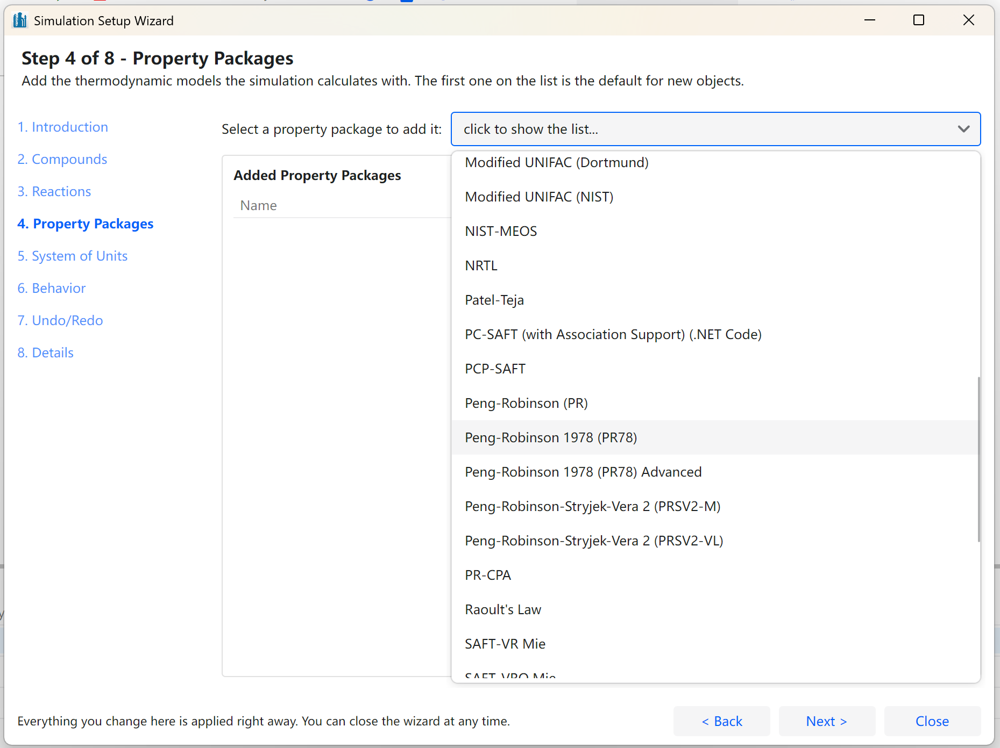
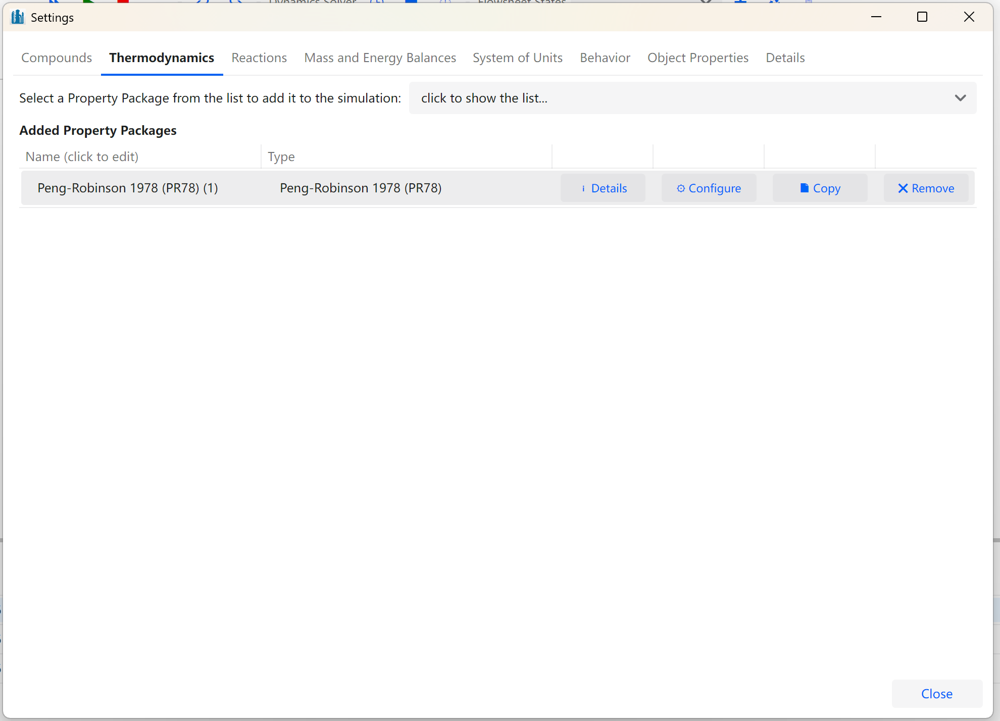
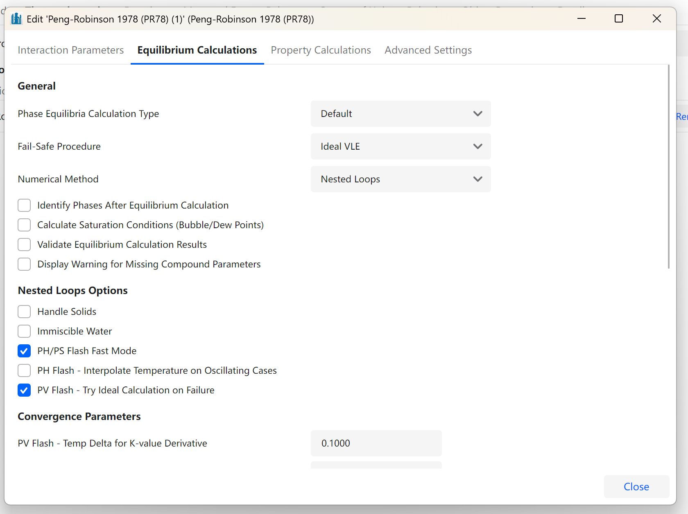
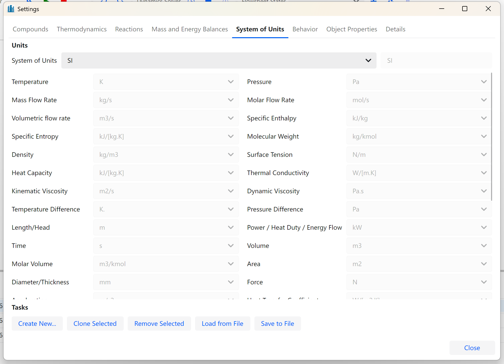
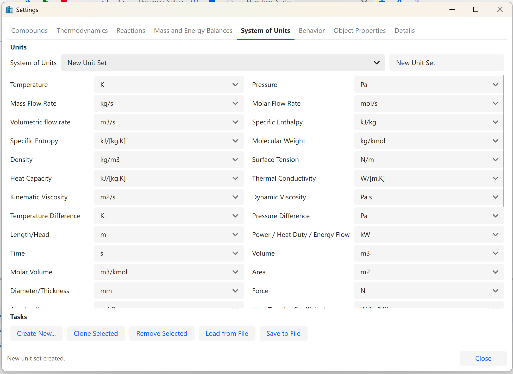

# Configuring a Simulation

In order to run a simulation/flowsheet, you need to add some Compounds, set up a Property Package, add Objects to the Flowsheet and connect them to each other following the process flow.

The first two are done in either of two places. The **Simulation Setup Wizard** walks through them in order and appears on its own when a simulation is created; the **Simulation Settings** window, opened from Edit \> Simulation Settings or with Alt+M, holds the same settings permanently and is where they are changed afterwards. Neither of them has an OK button: every change is written to the simulation as soon as it is made, so a wizard closed halfway keeps whatever has already been entered.

The wizard has eight steps, listed down its left-hand side: Introduction, Compounds, Reactions, Property Packages, System of Units, Behavior, Undo/Redo and Details. The Simulation Settings window presents the same material as tabs: Compounds, Thermodynamics, Reactions, Mass and Energy Balances, System of Units, Behavior, Object Properties and Details.

#### Components/Compounds

There are two essential information required by DWSIM in order to correctly start a simulation. The first refers to the available components (or compounds).

The compound list is the **Compounds** step of the wizard and the **Compounds** tab of the Simulation Settings window. To add a compound to the simulation, find it with the search box and select it on the list. To remove an added compound, just deselect it.

Compounds that are not in the databases shipped with DWSIM can be created or imported with the tools in the **Tools** menu, described later in this part.

*Selecting a Compound with the Simulation Setup Wizard.*

#### Property Packages

The Property Package consists in a set of methods and models for the calculation of physical and chemical properties of material streams in the simulation. It is composed of a thermodynamic model - an equation of state or a hybrid model - and methods for property calculation, like the surface tension of the liquid phase.

*Selecting a Property Package with the Simulation Setup Wizard.*

Property packages are added on the **Property Packages** step of the wizard and on the **Thermodynamics** tab of the Simulation Settings window. Choosing one on the combobox adds a copy of it to the simulation; the same package can be added more than once, with different settings each time.

The added packages are listed underneath in a grid, where the name can be edited and each one can be inspected, copied or removed.**Configure** brings up the property package editor, whose tabs are:

- **Interaction Parameters** - the binary parameters of the model, shown only for the packages that use them. Missing pairs can be estimated or regressed from experimental data.

- **Equilibrium Calculations** - the numerical method used for the phase equilibrium calculations (Nested Loops, Inside-Out or Gibbs Minimization), the type of equilibrium to force, the fail-safe procedure and the convergence tolerances.

- **Property Calculations** - which correlation is used for each physical property.

- **Electrolyte Settings** - the reaction set and the solver settings of the electrolyte packages, shown only for them.

- **Advanced Settings** - the compounds forced into the solid phase, and the property overrides described in the Python scripting chapter.

*Added property packages on the Thermodynamics tab of the Simulation Settings window.*

*The property package editor.*

###### Multiple Property Packages

DWSIM allows multiple Property Packages to be added to a single simulation (Figure [45](#fig:Viewing-Property-Packages)), which can be associated with each unit operation and material stream on an individual basis.

####### Skip Equilibrium Calculation in Well-Defined Streams

Tells the Flowsheet Solver to avoid rework and skip equilibrium calculations in Material Streams connected to specific ports like Separator Vessel and Distillation Column outlets.

####### Force Material Stream Phase

You can override the equilibrium phase for **all** Material Streams in the flowsheet by setting this property property to the desired value (*Vapor*, *Liquid* or *Solid*. The default value is *Do Not Force*.

When this property is set to one of the phase names (*Vapor*, *Liquid* or *Solid*), the equilibrium calculation for all Material Streams is bypassed and all compounds are put into the selected phase with the same composition as the mixture.

#### Systems of Units

Three basic units systems are present in DWSIM: **SI System** (selected by default), **CGS System** and **English (Imperial) System**. The units system in use is selected on the **System of Units** tab of the Simulation Settings window, which also lists the unit chosen for every quantity.

*The System of Units tab of the Simulation Settings window.*

You can also create a custom system of units, from **Tools \> Systems of Units**. A new set starts as a copy of an existing one, and each quantity is then given the unit you want. It is worth remembering that the units system can be changed at any time during the simulation - every value on screen is converted immediately.

*Creating a new System of Units.*

