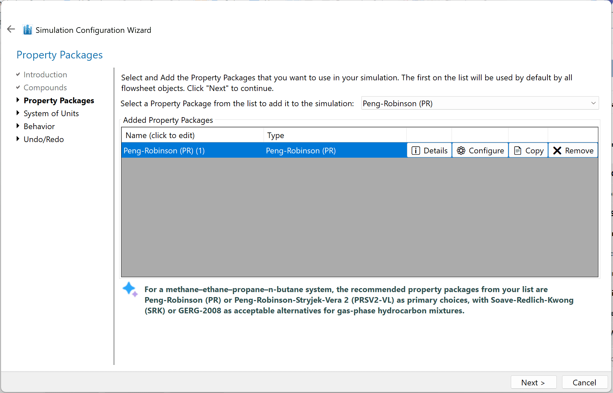
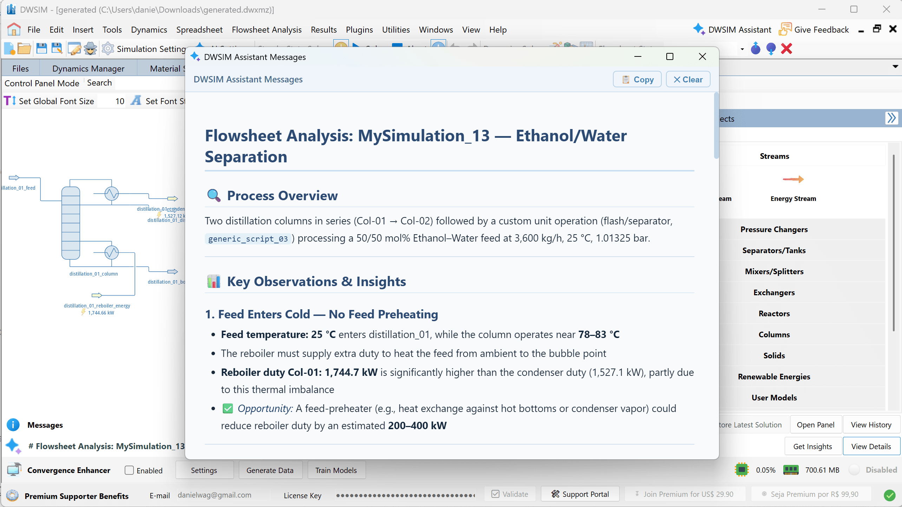
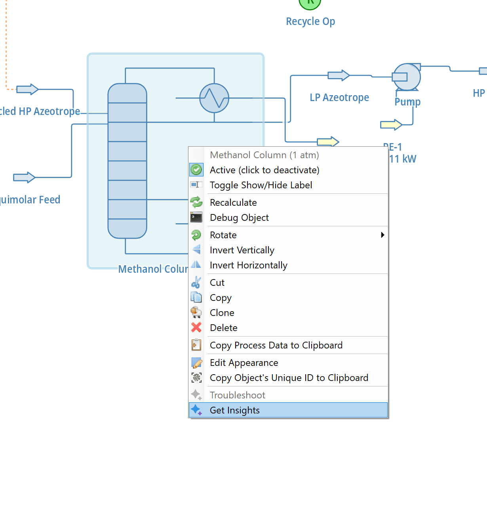

# AI-Powered Flowsheet Analysis

DWSIM integrates the AI Assistant directly into the simulation workflow at several key points. During the New Simulation Wizard, the Assistant automatically recommends the most suitable thermodynamic property package based on the compounds being modelled.

*Property Package AI recommendations.*

On any open flowsheet, the **Get Insights** and **Troubleshoot** buttons in the toolbar submit the entire flowsheet state to the Assistant and display a structured analysis in a Markdown viewer — the former focusing on optimization opportunities, the latter on diagnosing convergence or configuration issues.

*AI Insights for the current flowsheet.*

Both actions are also available via right-click on the PFD canvas for individual unit operations. Additionally, right-clicking a specific object and selecting **Get Insights** produces a targeted analysis focused on that particular unit operation or stream. All these features require the DWSIM Assistant server to be running and at least one LLM backend to be configured.

*AI Insights for the current unit operation.*

