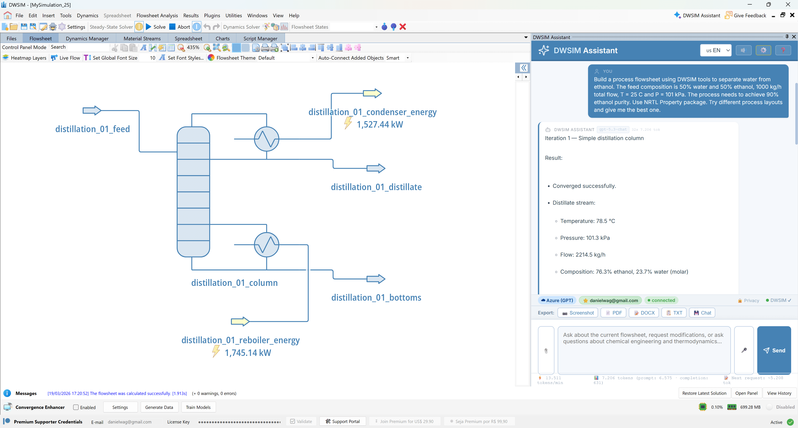
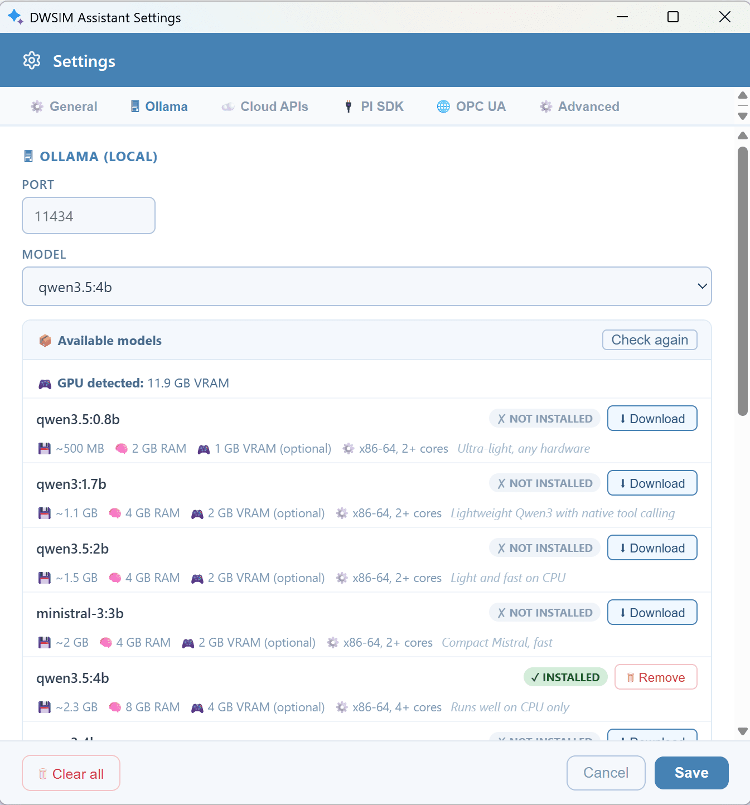
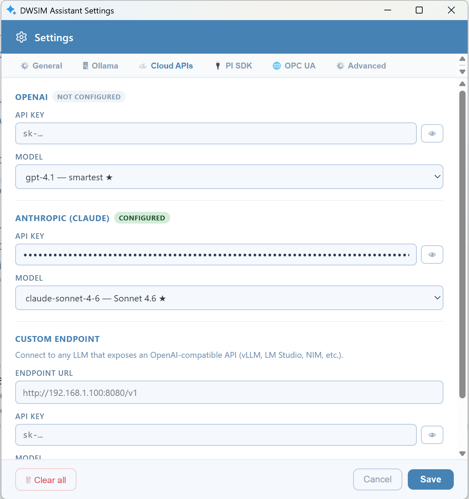

# AI Assistant

#### Overview

The DWSIM AI Assistant is an artificial intelligence interface integrated directly into DWSIM that allows users to interact with their process simulations using natural language. Powered by large language models (LLMs), the Assistant understands the current state of the open flowsheet — streams, unit operations, compositions, and thermodynamic conditions — and can answer questions, modify parameters, run the solver, and generate professional reports, all through a conversational chat interface accessible from within DWSIM’s main window.

*DWSIM AI Assistant.*

#### LLM Backends

The Assistant supports multiple AI providers, which can be switched at runtime without restarting the application. Backends are organized into two groups:

**Local backends** (all inference runs on the user’s machine — no data is sent to external servers):

- **Ollama** — free, open-source model runner. The Assistant auto-detects GPU memory and recommends models from lightweight sub-1B parameter models (CPU only) to 32B parameter models requiring 14 GB+ of VRAM.

- **LM Studio** — popular GUI-based local LLM engine (default port 1234). The Assistant can list, download, load, and unload models through LM Studio’s REST API.

- **llama.cpp (llama-server)** — high-performance inference engine. The Assistant includes a **bundled (embedded) llama-server** that can be downloaded and started automatically from within the settings panel — no external installation is required. Alternatively, users can connect to an external llama-server instance. GGUF model files can be downloaded directly from Hugging Face through the built-in catalog.

**Cloud backends** (requires an API key or credentials):

- **OpenAI** — GPT-4.1, GPT-4o, o3, and o4-mini series.

- **Anthropic Claude** — claude-sonnet-4-6, claude-opus-4-6, claude-haiku-4-5.

- **Google Gemini** — gemini-3-pro, gemini-3-flash, gemini-3-flash-lite.

- **AWS Bedrock** — uses the Converse API and supports Claude, Nova, Llama, and Mistral model families.

- **Azure OpenAI** — requires a valid DWSIM Premium Supporter license and a pre-configured Azure deployment.

- **Custom Endpoint** — any OpenAI-compatible endpoint such as vLLM or NVIDIA NIM.

*Ollama (local) LLMs.*

*Cloud-based LLM settings.*

##### Setting Up Ollama for Local AI (Offline Mode)

###### What is Ollama?

Ollama is a free, open-source tool that allows you to run large language models (LLMs) entirely on your own computer, with no internet connection, no API key, and no data sent to external servers. When configured as the active backend in DWSIM Assistant, all AI processing happens locally — your flowsheet data, prompts, and responses never leave your machine. This makes Ollama the recommended choice for users working in air-gapped environments, with confidential process data, or who simply prefer to avoid cloud services.

###### Step 1 — Install Ollama {#step-1-install-ollama}

1.  Open a web browser and go to **https://ollama.com**.

2.  Click **Download** and select the installer for your operating system (Windows, macOS, or Linux).

3.  Run the installer and follow the on-screen instructions. No special configuration is required during installation.

4.  Once installed, Ollama runs as a background service automatically. It listens on **http://localhost:11434** by default.

To verify that Ollama is running, open a terminal (Command Prompt or PowerShell on Windows) and run:

    ollama list

If Ollama is running correctly, this will display any models you have already downloaded (the list may be empty on a fresh install).

###### Step 2 — Download a Model {#step-2-download-a-model}

Ollama requires at least one model to be downloaded before it can process requests. DWSIM Assistant works with any model that supports tool calling (function calling). The recommended models and their hardware requirements are listed below.

To download a model, open a terminal and run:

    ollama pull <model-name>

For example:

    ollama pull qwen3.5:4b

The download may take several minutes depending on your internet connection and the model size.

###### Recommended Models

The following models are officially supported and tested with DWSIM Assistant. Models that support GPU acceleration will run significantly faster when a compatible NVIDIA or AMD GPU is available.

| **Model** | **Size** | **Min. RAM** | **Min. VRAM** | **Notes** |
|:---|:--:|:--:|:--:|:---|
| `qwen3.5:0.8b` | $\sim$<!-- -->500 MB | 2 GB | 1 GB (optional) | Ultra-light; runs on any hardware including old laptops |
| `qwen3:1.7b` | $\sim$<!-- -->1.1 GB | 4 GB | 2 GB (optional) | Lightweight Qwen3 with native tool calling |
| `qwen3.5:2b` | $\sim$<!-- -->1.5 GB | 4 GB | 2 GB (optional) | Light and fast on CPU |
| `ministral-3:3b` | $\sim$<!-- -->2 GB | 4 GB | 2 GB (optional) | Compact Mistral, fast |
| `qwen3.5:4b` | $\sim$<!-- -->2.3 GB | 8 GB | 4 GB (optional) | **Default** — runs well on CPU only; good balance for most users |
| `qwen3:4b` | $\sim$<!-- -->2.6 GB | 8 GB | 4 GB (optional) | Native tool calling, 4 billion parameters |
| `mistral:7b` | $\sim$<!-- -->4 GB | 8 GB | 6 GB (optional) | Solid general-purpose model |
| `qwen3:8b` | $\sim$<!-- -->5 GB | 8 GB | 6 GB (optional) | Versatile Qwen3, good quality |
| `qwen3.5:8b` | $\sim$<!-- -->5 GB | 8 GB | 6 GB (optional) | Good speed/quality balance |
| `llama3.1:8b` | $\sim$<!-- -->5 GB | 8 GB | 6 GB (optional) | Llama 3.1 general use |
| `qwen3:14b` | $\sim$<!-- -->9 GB | 16 GB | 10 GB (required) | High quality; requires a dedicated GPU |
| `qwen3:32b` | $\sim$<!-- -->20 GB | 32 GB | 20 GB (required) | Excellent quality; requires a powerful GPU |

Recommended Ollama Models for DWSIM Assistant

**Note:** Models marked as "GPU optional" can run using only CPU and system RAM, but will respond more slowly. Models marked "GPU required" will be impractically slow without a compatible GPU.

If you are unsure which model to choose, `qwen3.5:4b` is a good starting point for most computers. Users with a dedicated NVIDIA GPU and 8 GB or more of VRAM will get noticeably better performance with `qwen3:8b` or `qwen3.5:8b` .

####### Step 3 — Configure DWSIM Assistant {#step-3-configure-dwsim-assistant}

Once Ollama is installed and a model has been downloaded:

1.  Open DWSIM and launch the AI Assistant (via the **Tools** menu or the assistant toolbar button).

2.  Open the **Settings** panel inside the Assistant window.

3.  Go to the **General** tab.

4.  Under **Active Backend**, select **Local (Ollama)**.

5.  The model selector will populate automatically with all models you have installed. Select the model you downloaded in Step 2.

6.  Click **Save Settings**.

The Assistant will now use your local Ollama installation for all AI requests.

####### Changing the Ollama Port {#changing-the-ollama-port .unnumbered}

If you configured Ollama to run on a port other than the default 11434 (for example, to avoid conflicts with other software), you can update the port in the Ollama tab of the Settings panel. Enter the custom port number in the **Ollama Port** field and click **Save Settings**.

###### Model Management from Within DWSIM

The **Ollama** tab in the Settings panel includes a built-in model manager that allows you to download, install, and remove models without leaving DWSIM. The manager displays all supported models with their download size, memory requirements, and whether they are already installed. It also detects your GPU’s available VRAM automatically and highlights which models are compatible with your hardware. To install a model, simply click the Install button next to its name; to remove a model and free up disk space, click Remove.

###### Troubleshooting

####### The Assistant shows "Server not running" or cannot connect. {#the-assistant-shows-server-not-running-or-cannot-connect. .unnumbered}

Verify that Ollama is running by opening a terminal and running `ollama list` . If the command is not recognised, reinstall Ollama. If the command works but DWSIM still cannot connect, check that no firewall or antivirus software is blocking port 11434.

####### The model responds very slowly. {#the-model-responds-very-slowly. .unnumbered}

This is normal when running on CPU only. Consider downloading a smaller model such as `qwen3.5:0.8b` or `qwen3.5:2b` , or upgrade to a computer with a compatible GPU.

####### No models appear in the model selector. {#no-models-appear-in-the-model-selector. .unnumbered}

At least one model must be downloaded via\
`ollama pull <model-name>`\
before it appears in DWSIM. The model manager in the Ollama settings tab can also be used to install models directly.

####### I get an error about tool calling not being supported. {#i-get-an-error-about-tool-calling-not-being-supported. .unnumbered}

A small number of Ollama models do not support the tool calling feature required by DWSIM Assistant. Use one of the models listed in the table above, which are all verified to support this capability.

##### Setting Up LM Studio for Local AI

LM Studio is a free desktop application for running local LLMs with a graphical interface. To use it with DWSIM Assistant:

1.  Download and install LM Studio from **https://lmstudio.ai**.

2.  Open LM Studio, download a model from its built-in catalog, and load it.

3.  Ensure the local server is running (LM Studio starts it automatically on port 1234).

4.  In DWSIM Assistant, open **Settings → LM Studio**, verify the port, select the loaded model, and click **Save**.

5.  Set the active backend to **LM Studio** in the General tab.

The LM Studio tab includes a model manager that can list available models, download new ones, and load/unload models directly from within DWSIM.

##### Setting Up llama.cpp (llama-server) for Local AI {#setting-up-llama.cpp-llama-server-for-local-ai}

llama.cpp is a high-performance C/C++ inference engine that runs GGUF-format models. DWSIM Assistant offers two ways to use it:

###### Option A — Embedded Server (Recommended) {#option-a-embedded-server-recommended}

The Assistant can automatically download the llama-server binary and a recommended model, then manage the server process internally:

1.  Open **Settings → llama.cpp**.

2.  In the **Embedded Server** section, click **Download llama-server** if the binary is not yet present. The correct version for your operating system (Windows, Linux, or macOS) and GPU architecture is selected automatically.

3.  Click **Download Recommended Model** to fetch a compact GGUF model from Hugging Face.

4.  Select the downloaded model and click **Start Server**.

5.  Set the active backend to **llama.cpp** in the General tab.

Advanced settings (GPU layers, context size, port) can be adjusted in the expandable section before starting the server.

###### Option B — External Server {#option-b-external-server}

If you already have a llama-server or llamafile instance running externally:

1.  Start llama-server with the`--jinja` flag (required for tool calling).

2.  In **Settings → llama.cpp**, set the port (default 8080) and GGUF directory.

3.  Select the active model and click **Save**.

The llama.cpp tab also includes a GGUF model catalog for downloading models from Hugging Face directly into the configured model directory.

#### Flowsheet Interaction

The Assistant has direct, read-write access to the active simulation. It can retrieve a full summary of all objects in the flowsheet, query individual stream and unit operation properties, modify temperatures, pressures, molar flows, and compositions, add chemical compounds to material streams, and trigger the DWSIM solver — all as part of a natural language conversation. Results and changes are reflected immediately in the open flowsheet. When the user asks a question about process performance (such as conversions, yields, purities, or energy balances), the Assistant queries the flowsheet data directly rather than relying on general knowledge, ensuring that answers are always based on the current simulation state.

#### Report Generation

The Assistant can export professional process reports in plain text (TXT), PDF, and Microsoft Word (DOCX) formats. Reports include a complete inventory of all material streams (temperature, pressure, molar and mass flows, compositions, enthalpy, entropy, and vapor fraction), all unit operation parameters and sizing data, process performance indicators, energy consumption estimates, optimization suggestions, and a cost estimation section covering capital expenditure (CAPEX), operating expenditure (OPEX), and total annual cost (TAC). A PNG screenshot of the flowsheet process flow diagram (PFD) can also be exported directly.

#### Plant Data Integration

The Assistant optionally integrates with OSIsoft/AVEVA PI Data Archive and OPC UA servers, enabling users to query real-time and historical plant data as part of their simulation workflow. PI integration supports tag search, real-time snapshots, archived and interpolated time-series data, and statistical summaries (average, minimum, maximum, standard deviation). OPC UA integration supports node browsing, real-time value reading, historical data retrieval, and recursive node search. These integrations are only activated when the user explicitly mentions PI or OPC UA in their request; they do not interfere with normal simulation queries.

#### Configuration and Settings

All settings are accessible through the built-in settings panel, which is organized into ten tabs:

- **General** — active backend, language, and model selection.

- **Ollama** — port, model, and built-in model manager (download / install / remove).

- **LM Studio** — port, active model, and model manager (download, load/unload).

- **llama.cpp** — embedded server (automatic download of binary and recommended model), port, active model, GGUF directory, and model catalog for download from Hugging Face.

- **Cloud APIs** — API keys for OpenAI, Anthropic Claude, Google Gemini, AWS Bedrock, and custom endpoints.

- **License** — DWSIM Premium Supporter credentials to unlock Azure GPT and Flowsheet Design Mode.

- **PI SDK** — PI Data Archive server hostname and Windows credentials.

- **OPC UA** — OPC UA server URL, credentials, and security policy.

- **Certificates** — CA bundle and client certificates for corporate environments with internal CAs.

- **Advanced** — token estimation, report formatting, data sharing, script execution, prompt compaction, and Local-Only Mode (privacy firewall).

The active backend and model can be changed at any time. The interface is available in twelve languages: English, Portuguese (pt-BR), Spanish, Chinese, French, German, Russian, Arabic, Hindi, Japanese, Korean, and Italian.

#### MCP Tool Extensions

Advanced users can extend the Assistant’s capabilities by connecting external tools through the Model Context Protocol (MCP), the same open standard used by Claude Desktop. By editing the mcp_servers.json configuration file, users can connect the Assistant to any MCP-compatible server — such as database connectors, web search tools, file system access, or custom in-house tooling — and those tools become automatically available to the LLM during conversation.

#### AWS Bedrock Backend

AWS Bedrock is supported as a fully streaming backend through the Converse API. This allows the Assistant to use any model available on Bedrock — including Claude (Anthropic), Nova (Amazon), Llama (Meta), and Mistral — without running local infrastructure. Authentication uses standard AWS credentials: an Access Key ID and Secret Access Key entered in the Cloud APIs tab, or the default credential chain (IAM roles on EC2, ECS task roles, or environment variables). The AWS region defaults to**us-east-1** but can be configured in the settings. Bedrock is a good choice for enterprise teams that already have an AWS account and want to avoid managing API keys for individual providers.

#### Google Gemini Backend

The Assistant supports Google Gemini models via the OpenAI-compatible endpoint. Three model tiers are available:**gemini-3-pro** (most intelligent, best for complex reasoning),**gemini-3-flash** (fast and efficient, default), and**gemini-3-flash-lite** (fastest and lowest cost). To use Gemini, enter a Google AI API key in the Cloud APIs tab and select the desired model.

#### Knowledge Base (RAG)

The Assistant includes a built-in Retrieval-Augmented Generation (RAG) system that searches a local knowledge base before answering questions that require domain-specific data. Documents are stored in the`knowledge/` directory alongside the server executable (or in the source tree when running from source). The knowledge base ships with pre-built reference material covering compound physical and chemical properties, equipment sizing rules, thermodynamic correlations, safety limits, and IronPython scripting snippets.

When the user asks a factual question about process data, the Assistant automatically invokes the`dwsim_search_knowledge` tool, which performs a BM25 ranked search over all`.md` and`.txt` files in the knowledge directory and returns the most relevant passages. This ensures that answers are grounded in curated reference data rather than relying solely on the LLM’s training data. Users can extend the knowledge base by adding their own Markdown or plain text files to the`knowledge/` folder; the Assistant indexes them automatically on startup.

#### File Attachments

The chat interface supports file attachments. Users can attach images, documents, or other files to their messages by clicking the attachment button in the message input area. Attached files are displayed as chips showing the file name and size, and their contents are included in the LLM request so the Assistant can reference them in its response. The token estimation feature (see Advanced Settings) accounts for attachment sizes when computing the total request cost.

#### SSL / TLS Certificate Management {#ssl-tls-certificate-management}

For organizations that use corporate proxies, internal certificate authorities, or mutual TLS (mTLS) authentication, the Assistant provides a dedicated**Certificates** tab in the settings panel. Three fields are available:

- **CA Bundle** (`.pem` /`.crt`) — path to a PEM file containing trusted CA certificates. Required when the network uses a corporate proxy or internal CA.

- **Client Certificate** (`.pem` /`.crt`) — path to a PEM file with the client certificate. Required by servers that enforce mutual TLS.

- **Client Private Key** (`.pem` /`.key`) — path to the private key for the client certificate. Can be omitted if the key is embedded in the client certificate file.

Each field has a**Browse** button that opens a native file picker dialog. After saving, all MCP server connections (SSE and HTTP transports) and outbound API calls are automatically reconfigured with the new certificates. The environment variables`SSL_CERT_FILE`,`REQUESTS_CA_BUNDLE`, and`NODE_EXTRA_CA_CERTS` are also set, so any child process inherits the certificate configuration. A**Test Certificates** button validates that the configured files can be loaded correctly.

#### Flowsheet Design Mode

Flowsheet Design Mode is a special operating mode in which the Assistant can create, modify, and optimize complete process flowsheets from scratch through natural language instructions. It is activated automatically when the user asks the Assistant to design, create, build, or optimize a new flowsheet, provided a valid DWSIM Premium Supporter license is active. In this mode, the Assistant has access to additional tools:`dwsim_build_flowsheet` (to add and connect unit operations),`dwsim_clear_flowsheet` (to reset the simulation),`dwsim_add_section` (to organize the PFD into logical plant sections), and`dwsim_solve_and_score` (to solve the flowsheet and evaluate its economic performance with CAPEX and OPEX estimates using CEPCI cost correlations). The Assistant works iteratively, building and tuning the flowsheet in steps, solving after each change, and adjusting parameters to meet the specified design targets.

#### Advanced Settings

The**Advanced** tab in the settings panel provides fine-grained control over the Assistant’s behavior through six toggles:

- **Confirm before sending** — when enabled, a dialog showing the estimated token count and cost breakdown appears before each message is sent to the LLM, allowing the user to review or cancel the request.

- **Normalise AI response formatting** — strips`<think>` tags (produced by some models’ chain-of-thought reasoning) and standardises bullet points and headings in exported reports. Enabled by default.

- **Share anonymized conversation data** — opt-in toggle that sends anonymized conversation logs to the development team’s Supabase instance to help improve the Assistant. Disabled by default.

- **Enable IronPython script execution** — allows the Assistant to run arbitrary IronPython scripts inside DWSIM through the`generic_script` tool. Disabled by default for safety. Should only be enabled when the user trusts the prompts being submitted.

- **Compact prompts** — shrinks tool descriptions, truncates oversized tool results, and summarizes older conversation turns so that requests stay within per-call token limits. Enabled by default. Disabling this toggle sends the full uncompressed context, which may exceed the model’s context window on long conversations.

- **Local-Only Mode (privacy firewall)** — when enabled, blocks all outbound internet communication at the application layer. Only local backends (Ollama, LM Studio, llama.cpp) are allowed. Supabase telemetry is suppressed, license verification is skipped, and cloud API calls are rejected. A shield badge appears in the session bar to indicate the mode is active. This is the strongest privacy guarantee the Assistant offers: no data ever leaves the user’s machine. Ideal for air-gapped environments, sensitive processes, or users who want full control over data flow. Disabled by default.

#### Chat History and Logging

The Assistant logs all conversations locally in JSONL format under the`logs/` directory. Two files are maintained:`conversations.jsonl` (records every user message, assistant response, and tool call/result pair) and`feedback.jsonl` (records any feedback ratings submitted by the user on individual responses). Local logging is always active and works fully offline. When the data sharing toggle in the Advanced tab is enabled, logs are also synced to a Supabase cloud database; this is opt-in and disabled by default.

