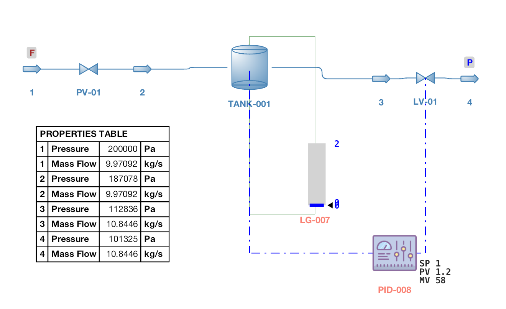

# Dynamic Simulation Structure and Configuration

#### Dynamic Model Setup

A dynamic model in DWSIM can be configured by starting from a solved flowsheet in steady-state mode. Additionally, each Boundary Material Stream must have a Pressure or Flow specification. In dynamic mode, a Valve Unit Operation connected to these streams will determine the Pressure-Flow relationships for the rest of the flowsheet as the remaining Unit Operation blocks get solved at each time step (Figure [53](#fig:dyn1)).

*Example of a valid flowsheet for dynamic mode. Both boundary streams are connected to valves. The inlet stream has a Flow specification while the outlet stream is Pressure-specified.*

#### Event Sets

Dynamic Events are property changes that occur in a defined time step. A group of Dynamic Events is called an Event Set.

Property change events can transition from a previous state ’suddenly’ (step change), linearly, log-linearly, inverse log-linearly or randomly between the two states (reference state and the one defined by the event itself).

#### Cause-and-Effect Matrices

Cause-and-Effect Matrices consist in a set of property changes that occur after an alarm is activated during the dynamic simulation. Each alarm activation triggers a property change defined by the user.

#### Integrators

Integrators are the components responsible to run the flowsheet sequentially in a dynamic simulation. They can be configured to run during a specified duration in fixed intervals, triggering the mass and balance solvers according to the user preference.

##### Monitored Variables

Each Integrator can have a set of monitored variables, that is, a set of object properties which will have their values stored after each integration step. Monitored variables can have their values exported for later visualization in the Spreadsheet.

#### Schedules

The Schedule is a set of definitions which, together, can be considered as a *case study* in the context of a dynamic simulation. A Schedule must have the following items defined in order to run:

- Associated Integrator (Required)

- Event Set (Optional)

- Cause-and-Effect Matrix (Optional)

- Initial Flowsheet State (Optional)

A Schedule can be run from the **Integrator Controls** window. After running a Schedule, the results (values of monitored variables at each step) can be copied to a new spreadsheet.

