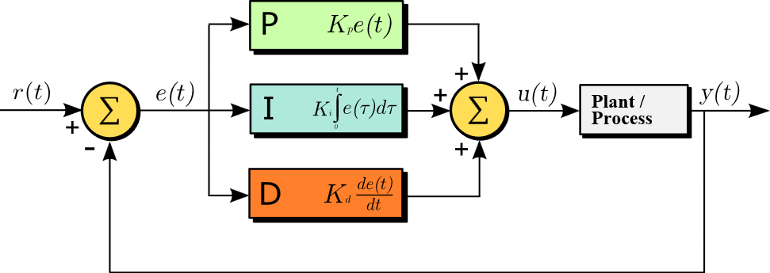
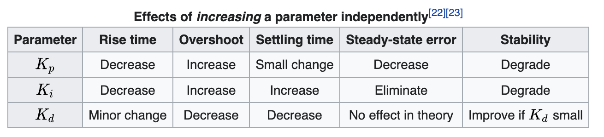
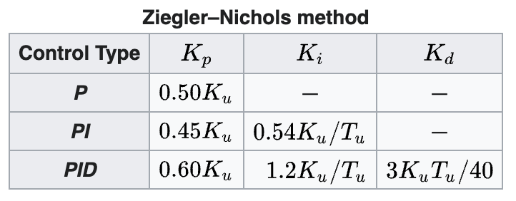
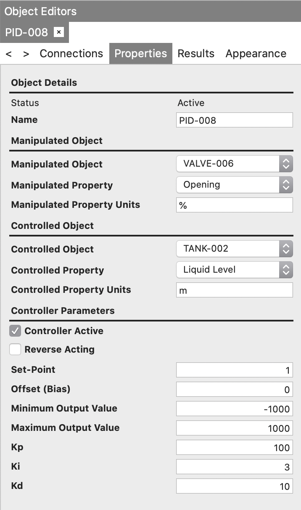
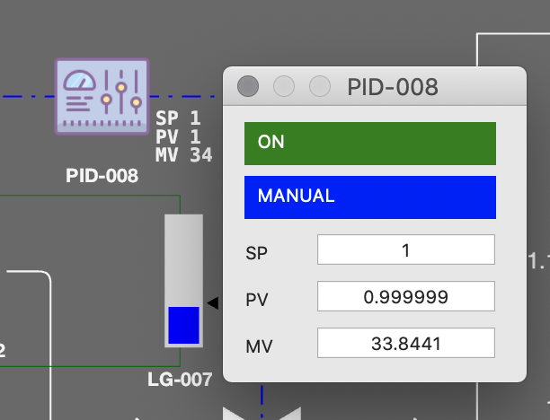
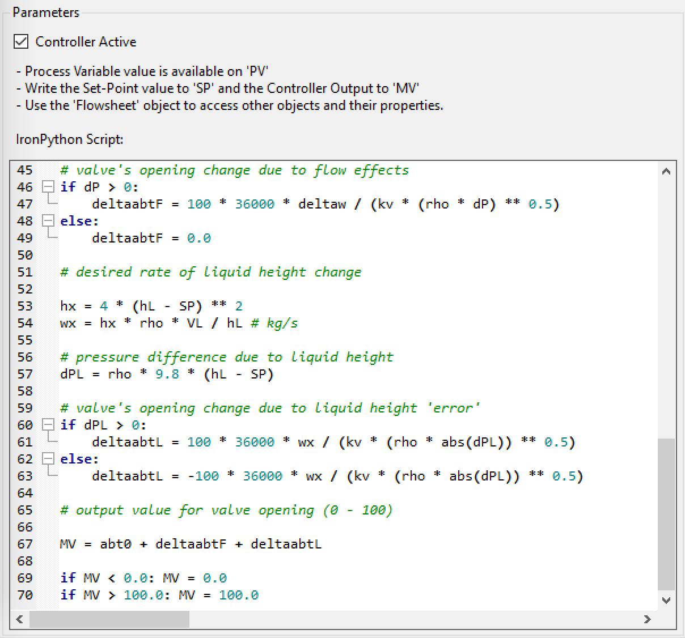

# Dynamic Simulation Flowsheet Blocks

#### Analog Gauge

Displays an analog gauge on the flowsheet. The gauge is associated to a property of an object on the flowsheet.

#### Digital Gauge

Displays a digital gauge on the flowsheet. The gauge is associated to a property of an object on the flowsheet.

#### Level Gauge

Displays a level gauge on the flowsheet. The gauge is associated to a property of an object on the flowsheet.

#### PID Controller

Introductory text taken from Wikipedia: <https://en.wikipedia.org/wiki/PID_controller>

##### Introduction

A proportional–integral–derivative controller (PID controller or three-term controller) is a control loop mechanism employing feedback that is widely used in industrial control systems and a variety of other applications requiring continuously modulated control. A PID controller continuously calculates an error value ${\displaystyle e(t)}$ as the difference between a desired setpoint (SP) and a measured process variable (PV) and applies a correction based on proportional, integral, and derivative terms (denoted P, I, and D respectively), hence the name.

In practical terms, it automatically applies accurate and responsive correction to a control function. An everyday example is the cruise control on a car, where ascending a hill would lower speed if only constant engine power were applied. The controller’s PID algorithm restores the measured speed to the desired speed with minimal delay and overshoot by increasing the power output of the engine.

##### Fundamental Operation

The distinguishing feature of the PID controller is the ability to use the three control terms of proportional, integral and derivative influence on the controller output to apply accurate and optimal control. The block diagram on ([54](#fig:dyn1-1)) shows the principles of how these terms are generated and applied. It shows a PID controller, which continuously calculates an error value $e(t)$ as the difference between a desired setpoint $\textrm{SP}=r(t)$ and a measured process variable $\textrm{PV}=y(t)$ , and applies a correction based on proportional, integral, and derivative terms. The controller attempts to minimize the error over time by adjustment of a control variable $u(t)$ , such as the opening of a control valve, to a new value determined by a weighted sum of the control terms.

*A block diagram of a PID controller in a feedback loop. r(t) is the desired process value or setpoint (SP), and y(t) is the measured process value (PV). (source: wikipedia)*

In this model:

- Term **P** is proportional to the current value of the PV − SP error $e(t)$ . For example, if the error is large and positive, the control output will be proportionately large and positive, taking into account the gain factor "K". Using proportional control alone will result in an error between the setpoint and the actual process value, because it requires an error to generate the proportional response. If there is no error, there is no corrective response.

- Term **I** accounts for past values of the PV − SP error and integrates them over time to produce the I term. For example, if there is a residual PV − SP error after the application of proportional control, the integral term seeks to eliminate the residual error by adding a control effect due to the historic cumulative value of the error. When the error is eliminated, the integral term will cease to grow. This will result in the proportional effect diminishing as the error decreases, but this is compensated for by the growing integral effect.

- Term **D** is a best estimate of the future trend of the PV − SP error, based on its current rate of change. It is sometimes called "anticipatory control", as it is effectively seeking to reduce the effect of the SP − PV error by exerting a control influence generated by the rate of error change. The more rapid the change, the greater the controlling or dampening effect.

Tuning The balance of these effects is achieved by loop tuning to produce the optimal control function. The tuning constants are shown as "K" and must be derived for each control application, as they depend on the response characteristics of the complete loop external to the controller. These are dependent on the behaviour of the measuring sensor, the final control element (such as a control valve), any control signal delays and the process itself. Approximate values of constants can usually be initially entered knowing the type of application, but they are normally refined, or tuned, by "bumping" the process in practice by introducing a setpoint change and observing the system response.

Control action The mathematical model and practical loop above both use a "direct" control action for all the terms, which means an increasing positive error results in an increasing positive control output for the summed terms to apply correction. However, the output is called "reverse" acting if it is necessary to apply negative corrective action. For instance, if the valve in the flow loop was 100–0% valve opening for 0–100% control output – meaning that the controller action has to be reversed. Some process control schemes and final control elements require this reverse action. An example would be a valve for cooling water, where the fail-safe mode, in the case of loss of signal, would be 100% opening of the valve; therefore 0% controller output needs to cause 100% valve opening.

Integral wind-up Integral wind-up, also known as integrator wind-up or reset wind-up, refers to the situation in a PID feedback controller where a large change in setpoint occurs (say a positive change) and the integral term accumulates a significant error during the rise (wind-up), thus overshooting and continuing to increase as this accumulated error is unwound (offset by errors in the other direction). The specific problem is the excess overshooting. This problem can be addressed by preventing the integral term from accumulating above or below pre-determined bounds (wind-up guard).

##### Mathematical form

The overall control function

\[
{\displaystyle u(t)=K_{\text{p}}e(t)+K_{\text{i}}\int_{0}^{t}e(t')\,dt'+K_{\text{d}}{\frac{de(t)}{dt}},}
\]

where ${\displaystyle K_{\text{p}}}$ , ${\displaystyle K_{\text{i}}}$ and ${\displaystyle K_{\text{d}}}$ , all non-negative, denote the coefficients for the proportional, integral, and derivative terms respectively (sometimes denoted P, I, and D).

##### Selective use of control terms

Although a PID controller has three control terms, some applications need only one or two terms to provide appropriate control. This is achieved by setting the unused parameters to zero and is called a PI, PD, P or I controller in the absence of the other control actions. PI controllers are fairly common in applications where derivative action would be sensitive to measurement noise, but the integral term is often needed for the system to reach its target value.

##### Overview of tuning methods

There are several methods for tuning a PID loop. The most effective methods generally involve the development of some form of process model, then choosing P, I, and D based on the dynamic model parameters. Manual tuning methods can be relatively time-consuming, particularly for systems with long loop times.

The choice of method will depend largely on whether or not the loop can be taken offline for tuning, and on the response time of the system. If the system can be taken offline, the best tuning method often involves subjecting the system to a step change in input, measuring the output as a function of time, and using this response to determine the control parameters.

###### Manual tuning

If the system must remain online, one tuning method is to first set $K_{i}$ and $K_{d}$ values to zero. Increase the $K_{p}$ until the output of the loop oscillates, then the $K_{p}$ should be set to approximately half of that value for a "quarter amplitude decay" type response. Then increase $K_{i}$ until any offset is corrected in sufficient time for the process. However, too much $K_{i}$ will cause instability. Finally, increase $K_{d}$ , if required, until the loop is acceptably quick to reach its reference after a load disturbance. However, too much $K_{d}$ will cause excessive response and overshoot. A fast PID loop tuning usually overshoots slightly to reach the setpoint more quickly; however, some systems cannot accept overshoot, in which case an overdamped closed-loop system is required, which will require a $K_{p}$ setting significantly less than half that of the $K_{p}$ setting that was causing oscillation.

*PID manual tuning summary.*

###### Ziegler–Nichols method

Another heuristic tuning method is formally known as the Ziegler–Nichols method, introduced by John G. Ziegler and Nathaniel B. Nichols in the 1940s. As in the method above, the $K_{i}$ and $K_{d}$ gains are first set to zero. The proportional gain is increased until it reaches the ultimate gain, $K_{u}$ , at which the output of the loop starts to oscillate constantly. $K_{u}$ and the oscillation period $T_{u}$ are used to set the gains as follows:

*Ziegler-Nichols tuning.*

These gains apply to the ideal, parallel form of the PID controller. When applied to the standard PID form, only the integral and derivative time parameters ${\displaystyle T_{i}}$ and $T_{d}$ are dependent on the oscillation period $T_{u}$ .

##### DWSIM Implementation

The PID Controller model in DWSIM allows you to configure $K_{p}$ , $K_{i}$ and $K_{d}$ , set the action type (direct or reverse), set the Integral Wind-Up Guard value and enable/disable the controller. In Control Panel (Real-Time) mode, clicking over the PID Controller icon will display a small panel where you can enable or disable it, set it to AUTO or MANUAL operating mode and change the SP and/or MV values.

###### PID Forms

DWSIM supports two PID controller forms. The **Parallel** form (default) computes the three terms independently:

\[
u=K_{p}\,e+K_{i}\int e\,dt+K_{d}\,\frac{de}{dt}+\mathrm{offset}
\]

The **ISA/Standard** form expresses the controller in terms of the proportional gain $K_{p}$ , integral time $T_{i}=K_{p}/K_{i}$ and derivative time $T_{d}=K_{d}/K_{p}$ :

\[
u=K_{p}\left(\beta\,e+\frac{1}{T_{i}}\int e\,dt+T_{d}\,\frac{de}{dt}\right)+\mathrm{offset}
\]

where $\beta$ is the setpoint weight for the proportional term (see below).

###### Derivative Improvements

Two options reduce noise sensitivity and derivative kick in the derivative term:

- **Derivative Filter Coefficient** ( $\alpha$ , range 0 to 1): applies a first-order exponential filter to the raw derivative. $D_{\mathrm{filt}}=\alpha\,D_{\mathrm{filt}}+(1-\alpha)\,D_{\mathrm{raw}}$ . A value of 0 disables the filter (default).

- **Derivative on PV**: when enabled, the derivative term is computed from the change in the process variable rather than the change in the error signal. This eliminates derivative kick when the setpoint changes abruptly.

###### Setpoint Weighting

Two weighting factors allow the controller to respond differently to setpoint changes versus load disturbances:

- **Setpoint Weight P** ( $\beta$ , default 1.0): scales the setpoint contribution in the proportional term. Reducing $\beta$ below 1.0 softens the initial response to setpoint changes, reducing overshoot while maintaining full disturbance rejection.

- **Setpoint Weight D** ( $\gamma$ , default 1.0): scales the setpoint contribution in the derivative term, providing additional control over the transient response.

###### Bumpless Transfer

When the controller transitions from Manual to Auto mode, the integral term is automatically recalculated so that the controller output matches the current manual output value at the moment of switching. This prevents abrupt output jumps during mode transitions.

###### Output Limits

The controller output can be constrained between configurable minimum and maximum values. In addition, the integral wind-up guard limits the accumulated integral term to prevent excessive overshoot after large setpoint changes or sustained errors.

###### Cascade Control

DWSIM supports cascade control by linking two PID controllers. Set the **Cascade Master ID** property of the inner (slave) controller to the name of the outer (master) controller. The master controller’s output then becomes the setpoint of the slave controller at each time step. Use the **Execution Order** property to ensure that the master controller executes before the slave.

###### Feedforward Control

A feedforward compensation path can be added to any PID controller to improve disturbance rejection. Configure the following properties:

- **Disturbance Variable**: the measured disturbance (simulation object and property).

- **Feedforward Gain**: the static gain relating the disturbance change to the required output correction.

- **Feedforward Lag Time**: applies a first-order lag filter to the disturbance measurement to smooth the feedforward action.

The feedforward output is added to the PID output before output limiting is applied.

*PID Controller Parameters.*

*PID Editor in Control Panel (Real-Time) mode.*

#### MPC Controller

##### Introduction

Model Predictive Control (MPC) is an advanced process control strategy that uses a dynamic model of the process to predict future behavior and optimize control actions over a finite time horizon. Unlike single-loop PID controllers, MPC can handle multi-input multi-output (MIMO) systems with constraints on both inputs and outputs simultaneously.

DWSIM implements the Dynamic Matrix Control (DMC) algorithm, one of the most widely used MPC formulations in the process industries. The controller uses step response models to relate changes in manipulated variables (MVs) to their effects on controlled variables (CVs).

##### Configuration Parameters

The MPC controller has the following main tuning parameters:

- **Prediction Horizon** ( $P$ ): the number of future time steps over which the controller predicts the process output. A longer horizon captures more of the process dynamics but increases computation. Default: 30.

- **Control Horizon** ( $M$ ): the number of future control moves that the optimizer calculates. After $M$ steps, the control move is held constant for the remainder of the prediction horizon. Default: 5.

- **Sample Time**: the time interval in seconds between consecutive control actions. This should match the step response model discretization. Default: 1.0 s.

- **Move Suppression Weight** ( $\lambda$ ): penalizes large control moves to produce smoother MV trajectories. Higher values give more conservative, slower control. Default: 0.1.

##### Controlled and Manipulated Variables

Each controlled variable (CV) is linked to a simulation object property and can be configured with:

- **Min/Max Value**: the desired operating range for the CV. The controller steers the CV toward the midpoint of this range.

- **Weight**: the relative importance of this CV in the control objective. Higher-weight CVs are prioritized when the controller must make trade-offs.

Each manipulated variable (MV) is also linked to a simulation object property and can be configured with minimum and maximum constraints that limit the physical range of the MV.

##### Step Response Models

The MPC controller requires a step response model for each CV-MV pair that describes how a unit step change in the MV affects the CV over time. Each model is defined by a first-order plus dead time (FOPDT) transfer function:

\[
G(s)=\frac{K}{\tau\,s+1}\,e^{-\theta\,s}
\]

where $K$ is the process gain, $\tau$ is the time constant, and $\theta$ is the dead time. The step response coefficients are generated automatically from these parameters using:

\[
y(t)=K\left(1-e^{-(t-\theta)/\tau}\right),\quad t\geq\theta
\]

To identify the FOPDT parameters for a given CV-MV pair, perform a step test: make a small step change in the MV and record the CV response over time. From the response curve, determine the gain (ratio of steady-state CV change to MV change), the time constant (time to reach 63.2% of the final value after the response begins), and the dead time (initial delay before the CV starts responding).

##### DWSIM Implementation

The MPC Controller is available in the Dynamic Simulation Flowsheet Blocks palette. To set up an MPC controller:

1.  Add controlled variables (CVs) by selecting simulation objects and their properties. Set the desired operating range (min/max) and relative weight for each CV.

2.  Add manipulated variables (MVs) by selecting the simulation objects and properties that the controller will adjust. Set physical constraints (min/max) for each MV.

3.  Add a step response model for each CV-MV pair. Enter the FOPDT parameters (gain, time constant, dead time) obtained from step testing or process knowledge. The controller generates the discrete step response coefficients automatically.

4.  Configure the prediction horizon, control horizon, sample time, and move suppression weight.

The MPC controller executes at each dynamic integration step. It reads the current CV values, calculates the optimal MV moves based on the step response models and the configured weights and constraints, and applies the first control move to the simulation. The Execution Order property determines the sequence in which multiple controllers are evaluated when more than one is present in the flowsheet.

#### Python Controller

The **Python Controller** is a custom dynamic mode controller where the relationship between the Process Variable, Set-Point and Manipulated Variable is defined by an IronPython script.

For more information, check the *Dynamic Water Tank Level Control with Custom Controller* sample.

*Sample Python Controller code.*

#### Input Box

The Input Box can be associated to a property of an object on the flowsheet. Clicking on the box will display an input field from where the user can update the property’s value directly.

#### Switch

The Switch can be associated to a property of an object on the flowsheet. Changing the value of the switch will update the associated property between two predefined values.

