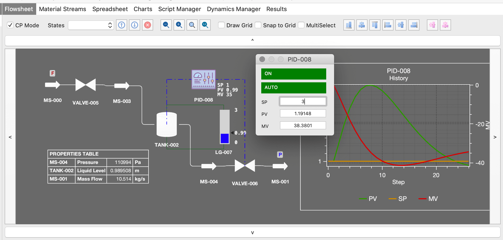
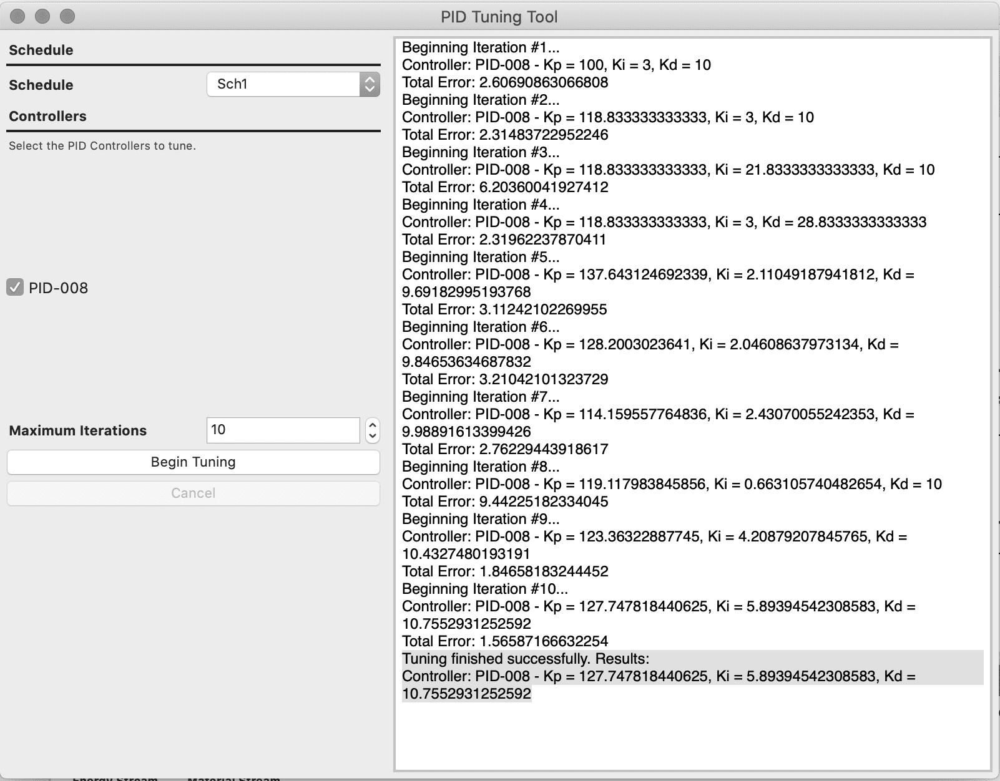

# Dynamic Simulation Tools

#### Control Panel Mode

Control Panel mode makes the Flowsheet read-only and must be used when a Schedule is running in real-time mode. In such scenario, variables can have their values changed through input boxes. You can also change some PID Controller parameters by clicking on their icons on the flowsheet.

*A Flowsheet running in Control Panel (real-time) dynamic mode.*

#### PID Controller Tuning

The PID Controller Tuning tool can be used to tune the parameters (Kp, Ki, and Kd) of one or more PID Controllers. It uses a numerical optimizer (Simplex) to obtain the PID parameters which minimize the squared sum of errors (PV - SP) for an entire schedule run.

*PID Controller Tuning Tool*

