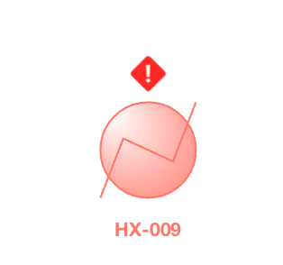

# Supported Unit Operations

As of v8.3, the following Unit Operations are supported in Dynamic Mode:

- Valve

- Gas-Liquid Separator

- Tank

- Compressor

- Expander

- Pump

- Heater

- Cooler

- Mixer

- Splitter

- Python Script Block

- CAPE-OPEN Block

- Heat Exchanger

- General Reactors (Conversion, Equilibrium and Gibbs)

- CSTR

- PFR

- Specification Logical Block

Unsupported Unit Operations will display an exclamation icon over their flowsheet objects when Dynamic Mode is enabled.

*Unsupported Unit Operation in Dynamic Mode.*

